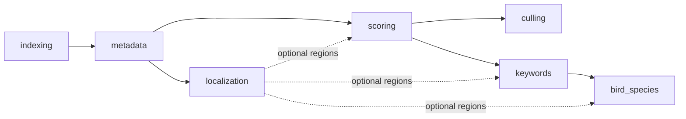

# Early localization — eight-stage rollout

This document defines an additive, reversible rollout for making object regions available soon
after metadata processing. The initial provider is the existing bird detector, but persistence and
phase boundaries are generic so another object class does not require another one-off JSON column
or hidden downstream side effect.

This is a **target design**, not a description of behavior already present in production. The
current graph and its implementation are documented in [phase-graph.md](phase-graph.md) and
[phases/bird-species.md](phases/bird-species.md).

## Consolidated status (2026-10-04)

This page is the status of record, with operational updates through 2026-10-08.
Epic #345's issue body still describes September 2026
(the live import "not yet run", stage 4 "open questions pending"). Replacing that body
needs a token that can edit issues; this page and #527 are the update.

This page remains the design of record for the eight stages. Later plans that change a stage
are folded into the table, not into a second rollout:

- [pipeline streamlining](../../planning/pipeline-streamlining.md) (#410) and its
  [spec hub](../../specs/pipeline-streamlining/INDEX.md)
- [blockers and decision register](../../specs/pipeline-streamlining/07-blockers-and-decisions.md)
  (historical snapshot 2026-09-25, with a 2026-10-04 delta at the top)
- [subject-aware culling evidence](../../planning/subject-aware-culling-evidence.md)

**Update 2026-10-05:** #558–#561 are merged. Stage 4's exit-gate code is on `master`; the gate
itself waits on one live lane cycle (an operator step). S4-4 was revisited and kept.

**Operational update 2026-10-07:** #368 is merged in
[PR #575](https://github.com/synthet/image-scoring-pipeline/pull/575) and closed.
Production is on migration **0040**. A verified database backup and a successful
full restore preceded a bounded live batch: three existing folders, 34 images,
15 completed jobs. All three culling parents waited for their linked children;
the six delegated stage projections matched child outcomes and timestamps.
Aggregate quality scores were preserved. See the
[operations report](../../reports/localization-rollout-operations-2026-10-07.md)
and [deployment and rollback procedure](../../technical/RUNS_QUEUE_AND_RESTART.md#deployment-and-rollback-0040).
These were explicit legacy-image submissions. Production still has no images
indexed after the enablement boundary and no current retryable localization
runs, so this batch does **not** meet the Stage 4 automatic-lane exit gate.
An isolated real-clock exercise verified automatic admission, bounded retries,
recovery and exhaustion. It exposed a strict phase-transition retry bug; the
minimal runner fix and PostgreSQL regression were local and not deployed at
the end of that session. Both findings are recorded in the operations report.

**Continuation 2026-10-08:** the strict retry fix merged in
[PR #577](https://github.com/synthet/image-scoring-pipeline/pull/577) with eight
successful checks and is loaded into the restarted backend. Three isolated
PostgreSQL repair regressions passed with zero skips. The four remaining
selected-region keypoint gaps were filled: all 4,401 active selected regions now
have final outcomes (4,370 detected, 31 no_keypoints). The canonical selected-region
species shadow comparison classified all 4,401 images with zero skips, finding
977 changed labels and 272 newly labelled images under its 360-species / 0.1
snapshot. The later workspace #422 policy (369 species / 0.5) needs its own
comparison before promotion. Production still has zero new images
after the enablement boundary and zero current retryable bird-localization runs;
the automatic-lane gate remains pending. See the
[continuation report](../../reports/localization-rollout-continuation-2026-10-08.md).

Stage sections below stay the original design. Where a section's own status heading is older
than this table, this table wins.

| Stage | Status through 2026-10-08 | Still open | What changed from the original design |
|---|---|---|---|
| 1. Control plane | **Done** (#346 and follow-ups). `localization` is a real phase after `metadata`. **#368 deployed and live-verified on 2026-10-07** (PR #575, revision 0040). | **#407** attempt-before edge and burst/picks split, not started. | Spec 02 adds **attempt-before** for `localization` → `scoring`. |
| 2. Normalized persistence | **Done.** Legacy import 2026-09-27: 76,475 current runs. Reader exists; `localization.read_normalized_first` stays off, so `bird_bbox` is still the production read. | Mask artifacts and a second keypoint pass (#426). | Region-linked keypoints landed in shadow (migration 0036, eye-pose backfill, [spot check](../../reports/eye-keypoint-spot-check-2026-09-27.md)). |
| 3. Rendition and crops | **Code complete** (#375). Detector benchmark done (#377). Default weights are `bird_detect_v1.pt` (#462), still `imgsz=640`. | Shared decode-once for every phase (#406). Slice 1 cache/pruner landed (#446). Portrait RAW thumbnails still reach CLIP/BLIP/MobileNet unrotated (#418). | One ~2048 px inference rendition for every phase (spec 01), not only localization. |
| 4. Shadow localization | **Slice 1 + M0 done** (#395, #414). Decisions S4-1..S4-5 accepted. Example config turns the phase and the bird detector **on**. **Exit-gate code merged** (#527, slices #538–#541): new-images-only boundary (#558), bounded repair (#559), phantom reconciliation (#560), repair lane (#561). | The live config has `localization.repair.enabled: true`; watch one lane cycle with eligible images before calling the exit gate met. Cascade is code (#451) but not the production detector (#408 still open). | YOLO → COCO-animal → small-box refine is a shadow provider. Primary-region choice is still a proposal on #408. Scene route can skip detection (#412, closed). |
| 5. BioCLIP on regions | **Slice 1 in code, off** (#444). `bird_species.use_regions` defaults false. One folder: 283/283 top-1 matched the legacy path, about 33% faster. | Do not flip the flag on this one folder. Abstention and list gaps (#422). Taxa beyond birds (#413). Multi-region classification flag is still design-only. | Legacy boxes are imported, not recomputed, before any species refresh. |
| 6. Crop / fusion | **Not started.** | #409 (crop score storage + fusion), #423 (evidence JSONL), #415 (~300 labelled bursts). | Region IQA is scoring design, gated on those bursts, not a global crop switch. Captions, accessibility, and Jev stay shadow. |
| 7. Repair and backfill | **Split.** Legacy import is done (stage 2). v1 rescan of 35,209 legacy misses is done and stays shadow unless a selection says otherwise. Bounded repair and the dispatcher-idle repair lane are merged as stage 4 work (#559, #561). | Live lane cycle (stage 4). Crop-score backfill waits on #409. `scripts/backfill_bird_bbox.py` still writes the JSON column and must be retired or rerouted before normalized authority. | No unbenchmarked full-library rescan. The v1 rescan was an explicit, resumable job, not an automatic scan of every new image. |
| 8. Retire `bird_bbox` | **Groundwork only** (#484). 4,401 selections already project `bird_bbox`. | Column stays. Gallery still reads it. `read_normalized_first` stays false. No compatibility period has started. | `image_localization_selections` (migration 0038) is the revocable production decision. For a selected image, `bird_bbox` is a projection written only by `modules/localization_selection.py`. |

**Beside the stages**

| Track | State |
|---|---|
| Scene route (#412) | **Closed.** SigLIP2 bird route at p ≥ 0.065 ([benchmark](../../reports/scene-route-benchmark-2026-10-02.md)). Wired in the localization runner. `config.example.json` sets `scene_route.enabled` true. Per-label thresholds remain #420. |
| Keywords / captions | #420, #421 open. |
| Burst segmentation and picks | #424, #407 open. |
| Timing baseline | #416 open. Blocks the 2048 px threshold revisit (S4-5) and crop-backfill cost. |
| Remote GPU phases | #440, #441 open. Localization is not on that rollout yet. |

**Promotion of v1 boxes**

The [2026-10-01 gate](../../reports/bird-v1-promotion-gate-2026-10-01.md) (#469) **failed**.
Rule `ecbb646e6649b3c2` did not clear a 0.90 Wilson lower bound on a fresh 207-image sample
(best stratum 53/60, lower bound 0.78). Those 16,666 v1 boxes were not promoted as a set.

#472 re-gated the cohort with the scene route. Rule `v1_regate_rule/3`
(`v1_regate_rule/3:a1c2e1f64b24cc79`: RTMDet conf ≥ 0.55, ≤ 3 RTMDet birds, SigLIP2
`scene_v3` p(bird) ≥ 0.5) passed owner validation on large (93/95) and medium (123/123).
The small stratum failed (42/45 usable, Wilson lower bound 0.821) and stays in shadow.

Step 6 finished on 2026-10-03 after the #488 clamp. The closing note on #472 records
**4,401** active selections, each projecting `images.bird_bbox`, each replacing
`{"detected": false}`. Promoted runs are stored and are not `is_current` (the v1 shadow
run stays current). Backup: `backups/postgres/image_scoring_20261002_184257.dump`.
Rollback is `promote_localization_selections.py revoke` on the same manifest.

Follow-ups, not part of the apply: eye keypoints on the selected region (#492), and a
shadow species re-run on those 4,401 images (#493).

### What is left

In order. Do not start a later row while an earlier blocker is open.

1. **#492 and #493** after the 4,401 promotions: both implementation issues closed
   on 2026-10-04. Selected-region keypoint coverage was verified and completed
   on 2026-10-08 (4,401 final outcomes); the full-cohort species comparison
   classified all 4,401 images with zero skips. Its retained snapshot used
   360 species and threshold 0.1; repeat under the later #422 list/floor before
   using these results for a keyword rewrite. See the
   [continuation report](../../reports/localization-rollout-continuation-2026-10-08.md).
   The small stratum stays in shadow.
2. **#527 stage 4 remainder** (repair lane, new-image boundary, auto-drive bucket, phantom
   reconciliation). The exit-gate text is:
   bounded repair (3 attempts, 1 min / 5 min, one repair job while core work is idle);
   a persisted enablement boundary for new or source-changed images;
   auto-drive must not use localization as the earliest blocking bucket;
   phantom reconciliation only when a current terminal attempt exists.
   Code for all four is merged (#558–#561). The live `config.json` already has
   `localization.enabled: true` and `localization.repair.enabled: true`. What remains is one
   lane cycle with eligible images: one lane job admitted while the dispatcher is idle, the
   backlog logged, and retryable failures re-attempted on the 1 min / 5 min schedule.
   On 2026-10-05, the live library had no images after the enablement boundary and no current
   retryable runs, so the lane had no candidates; this did not meet the exit gate.
   The same conditions were rechecked on 2026-10-07 after the successful explicit
   34-image batch. Isolated fault-injection validation is separate evidence and
   cannot substitute for an eligible production lane cycle.
   S4-4 was revisited and is kept (see Open questions).
3. **#418** before trusting scene, keyword, or embedding vectors on portrait RAWs.
4. **#408** adopt-or-drop the cascade. Slice 1 is in tree; production detection is still
   YOLO `bird_detect_v1` at 640. Do not change `imgsz` on the failed #377/#469 evidence.
5. **Stage 5 flag** stays off until a second folder (or a labelled species sample) matches
   the legacy path and #422's abstention rule is decided.
6. **Stage 6** waits on #415 labels, then #409 storage (prefer a sibling score table over
   changing the `image_model_scores` primary key; see the decision register) and #423.
7. **Stage 8** waits on a release where selections, region reads, and rollback of
   `read_normalized_first` have all been exercised. Physical drop of `bird_bbox` stays out
   of this rollout.

### Open questions

| ID | Question | Current answer | Revisit when |
|---|---|---|---|
| S4-4 | Should a localization job with retryable per-image failures end `failed`? | **No, kept 2026-10-05 now that the repair lane exists.** Completed, failures in the summary. The lane re-attempts them (3 attempts, 1 min / 5 min) and holds on an outage, so a failed job would add no repair path and would turn every detector outage into a pipeline failure. This supersedes the "run stage remains failed" sentence under [Status semantics](#status-semantics). | Exhausted failures pile up unnoticed after the live lane cycle. |
| S4-5 | Keep the 2048 px embedded-JPEG threshold? | **Yes.** | #416 measures decode cost per route. |
| C-1, C-2 | Refine IoU/padding, and whether COCO boxes are extra regions when YOLO also fires. | Unresolved. Cascade is not production. | #408 adoption review. |
| Promo | Which v1 boxes are production? | **4,401** large and medium selections (`v1_regate_rule/3`). Small stratum stays shadow. | A new rule and a fresh sample, not a rerun of #469. |
| Flags | `config.example.json` enables `localization` and `scene_route`. Live `config.json` is not in git. | Example is the intended default, not proof the library is running that way. | Next operator config review. |
| G-2 | Drop the `keywords` → `bird_species` edge? | **No**, until `use_regions` is the production path. | Stage 5 promotion. |
| SR-1 | Multi-label scene routing? | Store all probabilities; route on the bird threshold. | A second specialist workflow. |
| O-storage | Crop scores in `image_model_scores` or a sibling table? | **Sibling table**, unless a single table is required. | #409 design. |

### Blockers

| Blocker | Stops | Issue |
|---|---|---|
| Small v1 stratum failed the owner gate | Promoting the rest of the 16,666 shadow boxes | #472 (closed; small stays shadow) |
| Repair lane and new-image boundary merged, not yet run live | Calling stage 4's exit gate met | #527 (#558–#561) |
| Portrait RAW thumbnails unrotated | Scene, keyword, and embedding quality on those files | #418 |
| ~300 labelled bursts do not exist | Promoting subject-aware scores | #415 |
| No timing baseline on the 8 GB card | Crop-backfill cost and the 2048 px decision | #416 |
| Gallery must filter `input_mode` before a score-table migration | #409 | gallery #176 |
| Postgres suite can skip when the port or Alembic is wrong | Trusting `-m postgres` on a host Python | #379 |

**Design ideas from the reference-design analysis, and where they are tracked:**

| Idea | Where |
|---|---|
| decode once from the embedded preview | spec 01 |
| multi-class detector with a class-agnostic "animal present" rule | spec 03 |
| targeted second pass for small subjects | spec 03 refine, #426 |
| keypoints and mask | #426 |
| subject-conditioned evidence and named bands | #423 |
| code-owned burst ranking with ties surfaced | #424, gallery |
| abstaining species suggestions with burst propagation | #422 |
| determinism lessons | [ONNX feasibility](../../planning/models/ONNX_CONVERSION_FEASIBILITY.md) |

## Decision summary

Add an optional first-class `localization` phase after `metadata`, backed by a shared rendition and
crop service. Localization is attempted before downstream inference when co-requested, but its
artifacts are **preferred inputs, not hard prerequisites**, for scoring, culling, or keywords.



The initial behavior is deliberately conservative:

- Localize all **new or source-changed, metadata-complete** images without requiring a `birds`
  keyword.
- Persist region metadata and provenance; materialize padded crop files on demand.
- Keep culling and the production IQA/aesthetic result full-frame.
- Let BioCLIP consume bird regions first and fall back to a full frame.
- Add crop or fused inputs to other consumers only behind shadow flags and benchmark gates.
- Import existing `images.bird_bbox` values before scheduling any broad backfill.
- Keep shadow localization isolated from `bird_bbox` and every production completeness predicate;
  enable normalized authority and the legacy projection together only when BioCLIP migrates.

## Current-state constraints carried into the rollout

The current prerequisite registry places `bird_species` after `keywords`
(`modules/phases.py:56-64`). The bird-species runner selects only images with the `birds` keyword,
runs detection, crops the highest-confidence box when present, and otherwise classifies the full
frame (`modules/bird_species.py:258-294`, `:689-703`). The detector returns only the best box even
when more are available (`modules/bird_detection.py:179-225`), and the result is stored as one
unversioned `images.bird_bbox` JSONB value (`modules/db_postgres.py:544-592`).

The rollout must also preserve four independent convergence layers:

1. data-completeness predicates;
2. per-image `image_phase_status`;
3. per-run `job_phases` and image×phase work claims; and
4. folder rollups, auto-drive buckets, and heal/reconcile behavior.

`PhaseExecutor.depends_on` has historically been informational, and the submission paths have not
consistently enforced the same phase vocabulary, selector scope, ordering, or prerequisite policy.
Stage 1 resolves those control-plane differences before a seventh phase is introduced. Some of
that consolidation may already be in progress in the working tree; it remains part of the gate
until its routing, continuation, and recovery behavior is verified.

The September 7 recall audit found real boxes for only 20 of 59 frames in one bald-eagle set; the
remaining 39 were valid `{"detected": false}` outcomes even though every frame visibly contained a
bird. Subject size at `imgsz=640` is the leading mechanism, and one accepted box covered 93% of the
frame. This is a regression cohort rather than a library-wide recall estimate, but it means the
rollout must evaluate negative observations and suspicious geometry before relying on them
downstream ([bird-detection-recall-2026-09-07.md](../../reports/bird-detection-recall-2026-09-07.md)).

## Rollout invariants

Every stage must preserve these invariants:

- A missing, negative, stale, or failed localization result never suppresses core full-frame
  inference.
- `no_detection` is a versioned observation, not proof that no subject exists forever.
- Retryable detector errors remain repairable without pinning a folder ahead of core work.
- Full-frame and crop embeddings never share an embedding identity unless the input mode is part
  of that identity.
- Detector boxes are unpadded facts. Padding belongs to a versioned consumer crop policy.
- Region coordinates use one documented, display-oriented coordinate space.
- Multiple detections are retained up to a configured cap; consumers decide how many to use.
- A text-only decision model cannot create, validate, or complete a localization artifact. It may
  consume separately versioned evidence derived from a region, but never satisfies localization
  completeness or replaces pixel-conditioned confidence.
- Detector confidence, visual-evidence confidence, and downstream decision confidence remain
  separate signals. They are never multiplied into one undocumented score.
- A rollout stage can be disabled without deleting normalized region history.
- No stage requires an unbenchmarked full-library rescan.

## Feature flags and compatibility controls

Use flags with explicit defaults so each stage is independently deployable:

| Flag | Initial default | Purpose |
|---|---:|---|
| `localization.enabled` | `false` | Register/schedule the new phase. |
| `localization.new_images_only` | `true` | Prevent automatic legacy-library scanning. |
| `localization.detectors.bird.enabled` | `false` | Enable the initial detector provider. |
| `localization.dual_write_bird_bbox` | `false` | Maintain the legacy JSONB projection after normalized authority is enabled. |
| `localization.read_normalized_first` | `false` | Prefer normalized regions over `bird_bbox`. |
| `localization.repair.enabled` | `false` | Enable bounded retry and the independent repair lane. |
| `bird_species.use_regions` | `false` | Remove detection ownership from BioCLIP. |
| `bird_species.multi_region_enabled` | `false` | Classify more than the primary bird region. |
| `scoring.subject_crop_shadow` | `false` | Compute non-authoritative crop IQA metrics. |
| `tagging.crop_fusion_shadow` | `false` | Evaluate full-frame plus region keyword/caption signals. |
| `accessibility.crop_fusion_shadow` | `false` | Evaluate supplemental subject descriptions. |
| `typesafe.enabled` | `false` | Enable the shared text-only Jev client; never enables a consumer by itself. |
| `typesafe.keyword_shadow.enabled` | `false` | Report-only Jev keyword verification over allowlisted textual evidence. |
| `typesafe.culling_shadow.enabled` | `false` | Proposed stack-scoped Jev culling experiment; no production effect. |

`config.example.json` (2026-10-02) turns `localization.enabled`, `localization.detectors.bird.enabled`,
and `scene_route.enabled` **on**. `bird_species.use_regions` stays off. `localization.new_images_only`
is enforced on folder-scoped localization work against the `localization_enablement` boundary
(migration 0039, #527). The bounded-repair limit is in the runner and is derived from run
history (no attempt column); it applies to jobs submitted by the auto repair lane.
`localization.repair.enabled` has no effect until that lane lands (last #527 slice).

Flags are configuration controls, not provenance. Detector/model/config and crop-policy versions
must still be persisted with artifacts. Calibration-sensitive Jev experiments pin a versioned model
ID rather than a moving alias and persist the resolved model returned by the service.

---

## Stage 1 — Consolidate the control plane

### Goal

Make one phase registry authoritative before adding localization. Existing behavior should remain
unchanged except for correcting inconsistent or misleading phase state.

### Changes

- Use the canonical phase registry for ordering, prerequisite lookup, executor registration,
  dispatcher routing, run planning, retries, and orchestration.
- Stop stripping the string `bird_species` in `normalize_phase_codes`; it is already a
  `PhaseCode` member (`modules/phases.py:250-273`).
- Apply the same prerequisite check to `/api/runs/submit`, `/api/pipeline/submit`, dedicated
  phase submission, auto-drive, and heal-generated runs.
- Resolve the submitted selector before checking prerequisites so paths, folder IDs, image IDs,
  exclusions, and mixed selectors use the same scope. Validate requested execution order: a hard
  prerequisite may be satisfied already or appear earlier in the same plan, not merely anywhere
  in the submitted set.
- Bring `bird_species` under the same dispatcher/plan vocabulary while retaining its dedicated
  runner.
- Replace culling follow-up behavior that marks or presents a delegated parent phase as terminal
  before its child runs with durable parent/child linkage and outcome propagation. The parent
  remains unfinished until the child succeeds, fails, or is canceled; enqueue failure is visible.
- Define separate registry fields for hard prerequisites and preferred-before/artifact edges.

### Exit gate

- Every phase accepted by one run-submission API is either accepted by the others or explicitly
  documented as unsupported.
- Registry drift, phase normalization, all selector forms, invalid ordering, resume/restart, and
  parent/child success/failure/cancellation tests pass.
- Existing six-phase runs have unchanged work selection and outputs.

### Status — met, with one item deferred

Landed as #346 (PRs #350, #352, #353, #354) plus #364, #365, #366 and #367.

| Item | Where |
|---|---|
| Canonical registry for ordering, prerequisites, executors, planning | `modules/phases.py`, `modules/phase_executors.py`, `modules/pipeline_orchestrator.py:15` |
| `normalize_phase_codes` keeps `bird_species` | `modules/phases.py:326-346` |
| Same gate on `/api/runs/submit`, `/api/pipeline/submit`, auto-drive, heal | #351, #363 |
| Selector resolution before the gate (paths, folder ids, ordering) | #354, #352 |
| `bird_species` in the dispatcher/plan vocabulary | `tests/test_phase_submission_vocabulary_parity.py` |
| Hard vs preferred-before registry fields | `PHASE_PREREQUISITES` / `PHASE_PREFERRED_BEFORE` (#364) |
| Enqueue failure on a delegated hand-off is visible | #353 |

Two things this stage did **not** resolve, both carried forward:

- **Delegated parent/child lifecycle.** `modules/selection_runner.py:419-461` still marks the
  parent's remaining stages `skipped` with a delegation note and completes the parent regardless
  of the child's outcome. The planned contract — persist the link, leave the parent unfinished,
  propagate child success/failure/cancellation — needs a durable link column and DB-backed
  recovery tests, so it is scheduled with the schema work rather than here (#368).
- **Dedicated `/start` endpoints are prefix-expanding, not gated.** Gating them would be dead
  code; the reasoning is recorded in
  [phase-preconditions.md](phase-preconditions.md#why-the-start-endpoints-are-not-in-that-table)
  and satisfies the "explicitly documented as unsupported" clause above.

### Rollback

This stage contains correctness and consolidation work rather than a runtime feature. Revert the
registry integration as one unit if compatibility tests find an unhandled legacy caller; do not
partially retain multiple ordering authorities.

---

## Stage 2 — Add normalized persistence and a compatibility reader

### Goal

Represent positive, negative, failed, and multi-box localization outcomes with enough provenance
to determine whether an artifact is current.

### Schema

Add `image_localization_runs` with:

- image and originating job IDs;
- detector key, detector version, and detector-config hash;
- source hash/hash version and canonical-rendition hash/version;
- display-oriented coordinate space, orientation, width, and height;
- status: `detected`, `no_detection`, `retryable_error`, `terminal_error`, or `disabled`;
- retryability, error code, redacted error detail, and immutable attempt timestamps; and
- start, completion, and update timestamps.

Add `image_regions` with:

- localization-run ID;
- object class and provider class ID;
- confidence and deterministic rank;
- normalized `x1`, `y1`, `x2`, `y2` coordinates;
- geometry hash and timestamps; and
- uniqueness and range constraints.

Use one localization-run row even when zero regions are found. Absence of `image_regions` alone
must never mean either “not attempted” or “no detection.”

Keep immutable attempt history separate from mutable repair scheduling. Publish an attempt as the
current artifact only in the same transaction that persists its regions, and only if its source,
detector, configuration, and rendition identities still match the requested work. A source change
during inference leaves the attempt as superseded history rather than current output.

### Legacy import

Import without running inference:

| Legacy `bird_bbox` shape | Normalized interpretation |
|---|---|
| real coordinates | `detected`, one `bird` region |
| `{"detected": false}` | `no_detection` |
| `detector_unavailable` sentinel | `retryable_error` |
| other scan-failure sentinel | `terminal_error` unless explicitly classified retryable |
| NULL | not attempted |

Imported rows use `legacy_unversioned` detector and rendition provenance and retain the original
payload for exact compatibility, including malformed or unrecognized shapes. Do not infer a
historical source hash, orientation, or rendition from the current image row. Legacy geometry is
eligible for normalized crops only after its dimensions and orientation are verified; otherwise it
remains readable through the compatibility representation and eligible for controlled refresh.

### Compatibility behavior

- Continue reading `images.bird_bbox` while normalized reads are dark.
- Add a normalized-first reader with legacy fallback.
- Keep dual-write disabled during migration and shadow execution because `bird_bbox` already
  participates in production bird-species work selection.
- Do not alter existing species keywords or force new classification.

### Exit gate

- Migration is idempotent and preserves counts for every legacy shape.
- A synthesized legacy payload matches the pre-migration API representation.
- Unknown legacy provenance cannot silently become a current crop artifact.
- Query plans cover current artifact lookup by image and detector without table scans.
- Database growth per positive, negative, and error outcome is measured.

### Status — schema, import and reader landed; normalized reads stay off

The live import **has** run (2026-09-27, #414): 76,475 current runs. The paragraph
below is the 2026-09-22 survey that sized that import. The reader is still not on the
production path — `localization.read_normalized_first` is false — because turning it on
changes `is_image_bird_species_complete`. See the [2026-10-04 status](#consolidated-status-2026-10-04).

Issue #370. `migrations/versions/0034_image_localization.py` creates both tables, mirrored in
`modules/db_postgres.py` and registered in `POSTGRES_APP_TABLES`.
`modules/localization_legacy.py` carries the classification, the import
(`scripts/import_legacy_localization.py`) and the normalized-first reader.

Live-column survey (read-only, 2026-09-22) — the population is more uniform than this plan
assumed:

| Rows | Legacy shape | Normalized |
|---:|---|---|
| 41,001 | box, uniform keys `area_frac,conf,img_h,img_w,x1,x2,y1,y2` | `detected` |
| 35,085 | `{"detected": false}` | `no_detection` |
| 3 | `decode_error: …` | `terminal_error` |
| 320 | `NULL` | not attempted (no row) |

Zero constraint violations among the 41,001 boxes, and **no `detector_unavailable` sentinels at
all**, so nothing currently classifies as `retryable_error`. The plan's retryable-import row is
still implemented, just unexercised by this library.

Two clarifications the implementation forced:

- Coordinates are normalized against the `img_w`/`img_h` **in the payload itself**, and land in
  `coord_space = legacy_unverified` rather than the verified display space. The plan says not to
  infer orientation or rendition from the current image row; the payload's own dimensions are not
  such an inference, but the orientation genuinely is unrecoverable, so the space is marked.
- Unusable geometry (inverted, zero-area, missing dimensions) produces a `detected` run with **no
  region** rather than a clamped box. The detection is a historical fact; clamping would invent a
  box nobody detected.

Still open after the import: the reader is not wired into any production read path. That
wiring changes `is_image_bird_species_complete`, which feeds work selection, so it stays
off until stage 5 promotes `bird_species.use_regions`.

### Rollback

Disable normalized-first reads and continue using `bird_bbox`. The additive tables remain dormant;
do not drop imported data during rollback.

---

## Stage 3 — Establish the rendition and crop service

### Goal

Give localization and downstream consumers one deterministic way to obtain orientation-correct
full frames and region crops without making metadata own detector inference.

### Changes

- Define a canonical inference-rendition descriptor containing source/rendition hashes, decode
  route, orientation transform, display dimensions, color policy, and version.
- Bake orientation before detection and express region coordinates in normalized
  display-oriented space.
- Record which RAW path produced the pixels: embedded preview, `rawpy`, or ImageMagick. The
  existing decode chain can select different representations (`modules/thumbnails.py:420-527`).
- Materialize crops on demand from the region plus a named padding policy.
- Cache crops by source/rendition, orientation, geometry, padding policy, target size, format, and
  color-policy versions.
- Add bounded decoded-image reuse inside a job/process. Do not make runner correctness depend on
  another runner retaining tensors or model state.
- Retain up to the detector cap (initially 10) and rank by confidence, then stable geometry
  tie-breakers. Preserve the existing best-box interface as a compatibility projection.
- Reject out-of-range, inverted, or zero-area geometry. Record suspicious near-full-frame boxes in
  evaluation metrics; do not set a universal `area_frac` ceiling from a single observed outlier.
- Benchmark the current `imgsz=640` path against `imgsz=1280` and a targeted second-pass candidate
  on a pinned set containing detector positives, misses, true negatives, small subjects, textured
  backgrounds, and multiple species. Production defaults remain unchanged until the benchmark.

Current thumbnail generation resizes the image and copies the orientation tag for RAW files rather
than calling `bake_orientation` (`modules/thumbnails.py:671-739`). The service must therefore not
assume that stored thumbnail pixels already match display orientation.

### Exit gate

- Orientation fixtures 1–8 produce the same visual crop from original, RAW preview, and supported
  resized renditions within the defined tolerance.
- Crop keys change when any provenance or padding input changes.
- Cache eviction leaves durable metadata valid and crops reproducible.
- Concurrent crop requests coalesce or safely produce the same artifact.
- Detector evaluation reports recall, false positives, latency, and memory for the pinned cohort;
  the 59-frame eagle set is retained as a regression slice, not presented as a population rate.

### Status — code complete (#375); detector evaluation complete, pending review (#377)

Issue #375. `modules/rendition.py` supplies the identity half of this stage:

| Piece | What it fixes |
|---|---|
| `RenditionDescriptor` | Pixel identity — source hash, decode route, orientation, display dimensions, colour-policy and descriptor versions. Frozen; `source_path` is excluded from the hash so reorganising a folder does not invalidate cached crops for bytes that did not change. |
| `DecodeRoute` | Records *which* of embedded-preview / `rawpy` / ImageMagick produced the pixels. They differ in size, colour and sometimes crop, so two runs that picked different routes did not see the same image. |
| `CropPolicy` | Replaces the bare `padding` float `BirdDetector.crop_to_box` reads from config. As a float, a config edit silently changed every crop with no way to tell old from new; as a named, versioned policy it moves the cache key instead. |
| `crop_cache_key` | Content address over rendition identity + geometry + full policy. Geometry is quantised to 6 decimals, because float noise below a thousandth of a pixel would otherwise miss the cache for byte-identical crops. |
| `padded_pixel_box` | Pads by a fraction of the box's own size, then clamps at the frame edge rather than shifting inward — shifting would move the subject off-centre and pull in context the detector never saw on that side. |
| `normalize_pixel_box`, `is_suspicious_geometry` | Rejects inverted / zero-area / out-of-frame geometry rather than clamping; near-full-frame boxes are **recorded, never rejected**. |

`COORD_SPACE_DISPLAY` (`display_normalized`) is the verified counterpart to the
`legacy_unverified` space stage 2's import had to use, since historical orientation could not be
recovered.

Part 2 added the three remaining pieces:

| Piece | What it fixes |
|---|---|
| `thumbnails.open_rendition_for_ml` | Returns `(image, DecodeRoute)`. `open_image_for_ml` is now a one-line wrapper over it, so its 11 callers across 7 modules are unchanged. |
| `rendition.build_rendition_descriptor` | Builds a descriptor from already-decoded, already-oriented pixels. Display dimensions come from the *oriented* image — for EXIF 5..8 the transpose of the stored file. |
| `modules/crop_cache.py` | Content-addressed crops under `thumbnails/crops/{key[:2]}/`. Atomic temp-file + `os.replace` writes, per-key in-process locks, deterministic encoding, `prune_crop_cache` oldest-first. |
| `BirdDetector.detect_boxes`, `bird_detection.rank_boxes` | Up to `max_det` boxes ranked by confidence then `(y1, x1, y2, x2)`, geometry validated, near-full-frame flagged. |

**Exit-gate progress.** All five deliverables are present; the detector findings await review:

- *Orientation fixtures 1–8* — pass (part 1).
- *Crop keys change on any provenance or padding input* — pass (part 1).
- *Cache eviction leaves metadata valid and crops reproducible* — pass. The key is the durable
  identity; encoding is deterministic, so an evicted crop regenerates **byte-identically**.
- *Concurrent requests coalesce or safely produce the same artifact* — pass, both halves. Sixteen
  threads on one key render once. With the in-process lock removed to simulate separate processes,
  sixteen uncoordinated writers still never error.
- *Detector evaluation on a pinned cohort* — **complete, pending review**, tracked as #377.
  The [339-frame report](../../reports/detector-benchmark-2026-09.md) versions the cohort,
  human labels, results, and GPU allocation measurements. At 1280 the eagle slice improves
  from 20/59 to 53/59 detections, but 35/54 verified negatives in the no-keyword miss stratum
  become false detections (versus 0/54 at 640); tile-on-miss also has substantial false positives.
  The report includes confidence intervals and sampling/provenance limits. Keep production
  defaults unchanged; stage 4 may be designed in disabled shadow mode, with promotion and
  downstream crop use still gated on false-positive and localization-quality evaluation.

**Two findings from part 2.**

*Windows breaks the "last rename wins" assumption.* Removing the per-key lock made the losing
`os.replace` raise `PermissionError` 13 — a sharing violation, since Windows will not replace a file
another writer has open. POSIX would simply swap the inode. Nothing locks across processes, so this
was a real failure mode for webui + gpu-shell writing the same crop, hidden in tests only by the
in-process lock. The losing writer now treats the refusal as success once the winner's file is in
place (the bytes are identical by construction); a refusal with no winner still raises.

*`detect_best_box` is deliberately left non-deterministic.* It resolves equal confidences to
whichever box the model emitted first, and does not validate geometry. `images.bird_bbox` was
written under exactly that behaviour, so changing it would silently move stored boxes.
`detect_boxes` is the deterministic, validated API; the two are expected to disagree on malformed
predictions.

**Deferred to stage 5:** bounded decoded-image reuse. It was listed in the stage 3 scope but carries
no acceptance criterion, and while nothing may consume this service for authoritative output an
image cache would have no caller. BioCLIP becomes the first consumer in stage 5, which is where the
reuse pattern can be designed against a real access pattern.

**Also unchanged by design:** no production caller uses any of this yet. `bird_species.py` still
calls `detect_best_box` and `crop_to_box`; moving it onto regions is stage 5.

### Rollback

Disable cache reads and regenerate through the legacy full-frame path. No downstream consumer is
using the service for authoritative output yet.

---

## Stage 4 — Introduce first-class localization in shadow mode

### Goal

Run localization early for new or changed images, persist its artifacts, and integrate phase
convergence without changing downstream results.

### Phase behavior

- Add `localization` after `metadata` in canonical order.
- Hard prerequisite: `metadata`.
- Preferred-before consumers: `scoring`, `keywords`, and `bird_species`.
- Default scope: every new or source-changed metadata-complete image.
- Initial provider: the existing bird YOLO detector.
- Persist every accepted region up to `max_regions_per_class`, ranked deterministically.
- Define “new” with a persisted enablement boundary. Automatically select images indexed after
  that boundary and images whose source identity changes; unchanged legacy images require an
  explicit repair/backfill selection.
- When localization and consumers are co-requested, attempt localization first, but release the
  consumers to their full-frame paths after that attempt. Later retries run independently and do
  not hold the core run open.

### Status semantics

| Artifact result | IPS outcome | Downstream effect |
|---|---|---|
| one or more regions | `done` | regions available |
| valid scan, zero regions | `done` | full-frame fallback remains available |
| terminal source/decode error | `skipped` with reason | core phases continue |
| detector disabled | `skipped` with versioned reason | enabling invalidates the skip |
| retryable detector/runtime error | `failed` with backoff | repair lane retries; core phases continue |

The localization run stage remains failed when it contains retryable per-image failures, while the
orchestrator continues independent core stages and exposes the auxiliary failure in diagnostics.
It must not rewrite failed image outcomes as successful localization or report the entire run as
unconditionally successful.

### Convergence work

- Add localization to `image_phase_status`, `job_phases`, executor-version policy, work claims,
  folder summaries, JIT repair planning, restart/recovery, and diagnostics.
- Define data completeness as a matching `detected`, `no_detection`, or terminal outcome for every
  enabled provider. A retryable error is an attempt but never proof of completeness.
- Add safe phantom reconciliation only when a current terminal attempt proves work completion.
- Report localization backlog separately from core completion.
- Add bounded repair with this stage: at most three automatic attempts for one artifact identity,
  with delays of one minute and five minutes after the initial failure. Exhausted failures require
  an explicit retry or a changed source/detector/configuration/rendition identity.
- Reuse the image×phase claim across normal and repair submissions. Admit at most one repair job
  while core work is idle so repair cannot starve ingestion.

### Exit gate

- Shadow localization changes only normalized artifacts and localization diagnostics. It never
  changes `bird_bbox`, scores, tags, captions, culling, species outputs, embeddings, or production
  work-selection predicates.
- Duplicate submissions produce one open image×localization claim.
- Detector outage, restart, cancellation, retry exhaustion, and stale-claim recovery converge while
  core phases continue.
- Throughput, decode/inference time, GPU memory, region-count distribution, and failure taxonomy are
  available in metrics.

### Rollback

Set `localization.enabled=false`. Existing normalized artifacts remain readable but no new phase
work is planned. Disable `localization.repair.enabled` to stop queued retry admission without
invalidating artifacts; a lane job already queued still runs.

### Status — slice 1, M0 and exit-gate code done; one live lane cycle left

Registry, gated runner, provenance-stamped regions, and the S4-1..S4-5 decisions are in.
`config.example.json` enables the phase. The #527 remainder is merged:

- `localization.new_images_only` and the `localization_enablement` boundary (migration 0039), #558;
- bounded repair derived from run history (3 attempts, 1 min / 5 min), #559;
- phantom reconciliation from the current terminal run, #560;
- the repair lane in `modules/localization_lane.py`: one job at a time, only while no pipeline
  job is queued or running, outage hold, backlog logged apart from core completion. Localization
  stays out of auto-drive's folder buckets, #561.

The exit gate is met once one live lane cycle has run. S4-4 is kept; see
[open questions](#open-questions).
Details: [consolidated status](#consolidated-status-2026-10-04).

---

## Stage 5 — Move BioCLIP to normalized regions

### Goal

Make bird-species classification a consumer of localization rather than the owner of YOLO
detection.

### Candidate scope

Select the union of:

- images with one or more current `bird` regions; and
- images carrying the canonical `birds` discovery keyword.

This processes detector-positive images even if keyword scoring misses `birds`, while preserving
the existing full-frame fallback for keyword-positive detector misses.

### Inference behavior

- Classify the primary region first.
- Behind `bird_species.multi_region_enabled`, classify up to the configured region cap and persist
  region-linked predictions.
- Use full frame when the image is keyword-positive and no usable region exists.
- If a current `no_detection` conflicts with a later `birds` keyword, enqueue a targeted
  relocalization attempt once per artifact identity; do not wait before allowing full-frame
  classification, and do not rescan forever because the discovery keyword persists.
- Keep image-level `species:*` keyword projection for filtering and compatibility.
- Separate full-frame and region BioCLIP embedding provenance. The current implementation can
  persist either input into one image-level space (`modules/bird_species.py:258-294`, `:344-378`).
- Enable `localization.read_normalized_first`, `bird_species.use_regions`, and the legacy
  `bird_bbox` projection together. While normalized authority is active, the embedded legacy
  detector path must not overwrite that projection.
- Preserve existing species results unless an operator explicitly requests refresh. Record input
  mode, region/rendition identity, crop policy, and model identity on new predictions so later
  changes can identify stale results. Treat existing mixed-input BioCLIP embeddings as legacy.

### Exit gate

- With `bird_species.use_regions=false`, outputs match the legacy path.
- Region mode handles no region, stale region, crop failure, multi-bird frames, and detector outage
  without losing full-frame fallback.
- Detector-positive images without a `birds` keyword enter species scope, and keyword-positive
  detector misses keep the existing full-frame fallback.
- Planner decisions, SQL completeness, runner selection, and folder rollups agree on the expanded
  candidate scope.
- Human/expert evaluation covers species accuracy, calibration, small-subject images, and multiple
  subjects before multi-region results become authoritative.
- The legacy detector-only bbox repair path is no longer needed for new work.

### Rollback

Disable `bird_species.use_regions` and normalized-first reads together. The legacy detector path
and existing `bird_bbox` values remain available during the compatibility period.

---

## Stage 6 — Run optional downstream crop/fusion experiments

### Goal

Evaluate region inputs without changing established full-frame semantics prematurely.

### Mode contract

Every experimental output records one of:

- `full_frame`;
- `region`; or
- `fusion`.

The input artifact hash, region ID, crop-policy version, model version, and fusion version are part
of provenance.

**Storage prerequisite.** `image_model_scores` is keyed `(image_id, model_name)` and has no region
or input-mode dimension, so a full-frame and a region score from the same model cannot both be
stored as rows today; `is_shadow` only separates experimental models. Until a migration adds that
dimension, region IQA results stay in research artifacts (JSONL/reports), never in
`image_model_scores`. Whatever key extension is chosen, scoring completeness and fusion must keep
counting only non-shadow full-frame rows. Details:
[region scores and backfill](../../planning/localization-region-scores-and-backfill.md).

### Text-evidence and Jev decision boundary

Jev is a text/structured-state decision model, not a vision model. It cannot receive image bytes,
validate a detector box, measure crop quality, or recover visual facts omitted by an upstream
captioner. A Jev experiment therefore uses an explicit downstream boundary rather than becoming a
localization provider:

```text
region/crop -> visual evidence extractor -> versioned structured evidence
            -> Jev atomic judgments -> code-owned gate/policy -> shadow recommendation
```

The visual evidence extractor owns pixel-conditioned facts and their reliability: grounded subject
attributes, named quality bands, region/full-frame agreement, and pairwise differences within a
burst. Jev owns only semantic judgments over that state, such as keyword support, distinctiveness,
redundancy, or a bounded action choice. Geometry validation, thresholds, ranking, probability
composition, and all arithmetic remain in code.

Prefer compact, typed attributes over long prose or raw numeric dumps. Convert detector and quality
values to named, versioned bands for model-visible state while retaining the raw values in the
durable evidence record. Allowlist model-visible fields: file paths, GPS/EXIF, credentials, arbitrary
metadata, and unfiltered diagnostic text must not enter the hosted request.

Persist visual evidence separately from semantic judgments:

- an evidence artifact records its scope (`image`, `region`, or `stack`), source/rendition and
  region identities, extractor/model/config versions, evidence-schema version, raw measurements,
  model-visible state hash, evidence-confidence signal, and stated limitations; and
- a Jev judgment records the evidence hash, pinned and resolved model IDs, rubric key/version,
  primitive and option/level definitions, full probability vector, model confidence,
  evidence-sufficiency result, calibration version, decision-policy version, and shadow/authority
  state.

Stack judgments additionally record the ordered member-set hash and retained-set hash. A culling
judgment is stale when either context changes even if every image and region artifact remains
current. It must not reuse the image-scoped localization work claim as proof of group-scoped
completion.

Ask evidence sufficiency and the atomic consumer questions in the same request when they share one
state, matching the existing batched client behavior. The answers are independent: application code
must ignore or route a recommendation when evidence sufficiency, evidence confidence, or calibrated
decision confidence misses its action-specific gate. Never treat Jev confidence as confidence in
the original pixels.

Run Jev through a separate bounded, rate-limited queue with timeouts, `429` backoff, a circuit
breaker, and evidence-hash deduplication. SDK absence, missing credentials, timeout, or service
failure produces no verdict and never fails localization, scoring, tagging, or culling. Jev retry
work does not share or consume the localization GPU-repair lane.

### Consumer policy

| Consumer | Stage-6 mode |
|---|---|
| Production IQA/aesthetic score | full frame remains authoritative; region score is shadow-only |
| Technical failures | global full-frame metrics plus separately named subject-region metrics |
| MobileNet/culling embeddings | full frame only |
| CLIP/OpenCLIP similarity spaces | existing image spaces stay full-frame; region spaces are separate |
| Keyword scoring | shadow full-frame + region score fusion |
| Captioning | canonical scene caption plus optional subject-region clause |
| Accessibility | full-frame description plus optional subject detail |
| BioCLIP | region-first with full-frame fallback after Stage 5 gates |
| Keyword verification with Jev | report-only region-aware evidence; never removes or adds a production keyword |
| Culling with Jev | stack-scoped shadow only after pairwise visual evidence exists |

The existing crop study supports experimentation, not unconditional replacement: crop IQA is more
sensitive to constructed subject degradation, captions become more distinct, and culling does not
show a material crop benefit (`docs/reports/BIRD_BBOX_CROP_STUDY_2026-08-01.md:23-29`, `:72-100`).
Its species and caption results are not human accuracy evidence (`:118-125`).

The existing Jev Phase-0 arm is also a control, not promotion evidence. On 5,893 shadow calls over
whole-frame scores, captions, concepts, and retained-set similarity, direct historical-label
agreement was 0.256, pick recall was 0.017, multiclass Brier score was 0.997, mean decision
confidence was 0.454, and mean evidence sufficiency was 0.482
(`reports/typesafe-culling-real-data/phase0-jev-full-score-summary.md`). Typed output held under load,
but the supplied evidence did not support the requested decision.

Evaluate new region/pairwise evidence and Jev separately on folder-grouped splits:

| Arm | Evidence | Decision | Question answered |
|---|---|---|---|
| A | existing scores | deterministic/ranker baseline | what does the current evidence support? |
| B | scores plus region/pairwise evidence | the same ranker | does the new evidence add signal? |
| C | exactly Arm B evidence | Jev | does Jev add value over code/ranking? |
| D | existing whole-frame captions | Jev | does the known weak-evidence control reproduce? |

Arm B must beat Arm A before Arm C can be credited to Jev. Arm C must then beat Arm B on the same
evidence and meet calibration, coverage-risk, cost, and latency gates. Otherwise retain the ranker
and restrict Jev to narrower shadow judgments such as distinctiveness, redundancy, or keyword
support.

### Exit gate

- Full-frame, region-only, and fusion modes are evaluated on the same pinned population.
- Accuracy/factuality, false-negative propagation, throughput, GPU memory, model loading, and
  end-to-end runtime are reported.
- Region-aware keyword shadowing compares against genuine source confidence/similarity and human
  labels rather than treating default-filled `image_keywords.relevance_weight` values as a
  calibrated baseline.
- Evidence extractors are evaluated independently before their output is credited to Jev; the
  four-arm comparison reports folder-grouped discrimination, calibration, coverage, cost, and
  latency.
- Detector, evidence, evidence-sufficiency, and Jev decision confidence are reported separately,
  with action-specific thresholds calibrated on held-out data.
- Stack membership and retained-set changes invalidate group-scoped judgments, while Jev outage and
  retry exhaustion leave core and localization convergence unchanged.
- A consumer ships crop/fusion only when its own quality gate passes; there is no global “crops
  enabled” switch.

### Rollback

Disable the individual consumer flag. Disabling `typesafe.enabled` stops all new Jev calls without
invalidating evidence artifacts. Shadow rows may remain for research but cannot influence production
scores, culling, keywords, or metadata.

---

## Stage 7 — Controlled repair and backfill

### Goal

Refresh missing or stale localization artifacts without requiring an immediate full-library scan
or starving core pipeline work.

### Scheduling order

1. Import existing `bird_bbox` values and sentinels.
2. Process new and source-changed images.
3. Repair `birds`-keyword images with no current attempt, a retryable error, or a deduplicated
   keyword/negative-observation conflict.
4. Process explicitly requested folders.
5. Sample the remaining legacy-unversioned population.
6. Expand to the remaining library only after cost and quality gates pass.

### Auto-drive model

Do not make localization the one earliest blocking folder bucket. Maintain:

- the existing core pipeline bucket; and
- a separately rate-limited localization-repair lane.

Reuse Stage 4's bounded retry and claim mechanism. Exhaustion remains visible for operator action
instead of looping. Source, detector, config, or rendition-version changes reset eligibility
deliberately. Backfills persist their cursor/progress so an interruption resumes without replaying
completed partitions.

### Cost gate

Measure rather than assume:

```text
current incremental cost = N(birds-keyword candidates) × (decode + detector)
all-image incremental cost = N(metadata-complete new/changed images) × (decode + detector)
cost multiplier = N(all eligible images) / N(birds-keyword candidates)
```

The crop-study snapshot contains 37,417 real boxes and 29,068 no-detection sentinels with no NULL
remaining (`docs/reports/BIRD_BBOX_CROP_STUDY_2026-08-01.md:62-70`). The stage 2 live survey
(2026-09-22) has since grown to 76,086 outcomes: 41,001 boxes, 35,085 sentinels, 3 decode errors
and 320 NULLs (see the stage 2 status above). Those outcomes should be imported, not recomputed
blindly.

`scripts/backfill_bird_bbox.py`, the detector-only backfill in use today, writes `images.bird_bbox`
alone. Once normalized regions become the authority it would bypass them, so this stage either
retires it or reroutes it through the localization phase and its claims.

This stage backfills **boxes**, not scores. There is no plan to backfill region IQA into production
tables; that remains Stage 6 shadow work behind its own gates.

### Exit gate

- Repair claims are idempotent under concurrent manual, auto-drive, and run-submission requests.
- Core pipeline folders continue advancing while localization repairs are failed or cooling down.
- Operators can see current, stale, negative, retryable, terminal, and legacy-unversioned counts.
- Every broad backfill exposes a dry-run count and estimated detector/decode cost before execution.
- A representative benchmark establishes whether direct all-image detection meets the agreed
  GPU-hour and ingest-latency budgets. A two-pass triage design is considered only if it does not.

### Rollback

Disable `localization.repair.enabled`, leave new-image localization active if healthy, and retain
the last successful artifacts. Cancel queued repair jobs without invalidating normalized rows.

---

## Stage 8 — Retire compatibility paths

### Goal

Remove duplicate sources of truth after all consumers and operational workflows use normalized
localization artifacts.

### Preconditions

- Backend and gallery contracts read normalized regions.
- No supported consumer performs authoritative reads directly from `images.bird_bbox`.
- No supported writer, including `scripts/backfill_bird_bbox.py`, writes `images.bird_bbox` without
  a normalized run.
- BioCLIP no longer owns detector loading or bbox-only repair.
- Normalized artifacts, repair, restart/recovery, and auto-drive have completed a compatibility
  period of at least one complete release with no unresolved convergence regressions.
- Rollback telemetry confirms that normalized-first reads can be disabled independently.

### Changes

- Stop dual-writing `images.bird_bbox`.
- Retain a synthesized compatibility field or database view for supported external readers.
- Remove the embedded bird-detection path and legacy bbox-only repair code.
- Remove legacy completeness predicates that make bird-species completion depend on `bird_bbox`.
- Deprecate the JSONB column. Any physical drop is a later, separately reviewed migration after
  compatibility consumers have been removed.
- Promote only benchmark-approved crop/fusion modes; leave rejected experimental paths disabled or
  remove them.

### Exit gate

- Searches, API telemetry, and compatibility tests show no direct legacy reads.
- A rollback rehearsal can re-enable the synthesized legacy representation without rerunning
  detection.
- Documentation and API/schema references identify normalized regions as the sole authority.

### Rollback

Before the eventual column-drop migration, re-enable synthesized or dual-written `bird_bbox`.
After the drop, rollback uses the normalized-to-legacy projection; it must not require restoring a
database backup or rescanning image files.

---

## Cross-stage validation matrix

| Area | Required scenarios |
|---|---|
| Unit | coordinate transforms, orientation, padding, hashes, multi-box ranking, status mapping, invalidation, input-mode selection |
| Integration | submit → plan → claim → localize → consume, every selector form, ordering rejection, both submission APIs, dual-read/write, region/full-frame fallback, strict shadow isolation |
| Migration | every legacy bbox/sentinel shape, malformed payload, NULL, unknown provenance, existing species keywords, repeat upgrade, rollback projection |
| Recovery | crash during detection, region transaction, crop creation, consumer inference, parent/child success/failure/cancellation, enqueue failure |
| Concurrency | duplicate runs, repair versus normal run, source change during inference, detector-version transition |
| Auto-drive | retryable failures do not block core work, backoff converges, terminal outcomes stop requeueing, stale versions reopen work |
| RAW/orientation | EXIF orientations 1–8, embedded preview/rawpy differences, display/source coordinate round trips |
| ML quality | full frame vs region vs fusion, false-negative recovery, multi-subject accuracy, calibration and small-subject slices |
| Semantic decisions | evidence-schema and rubric versioning, allowlisted state, evidence-hash deduplication, image/region/stack invalidation, independent confidence gates, same-evidence ranker-vs-Jev comparison, model pinning, timeout/429/outage fail-open behavior |
| Performance | decode/detector/crop/model time, throughput, GPU memory, model-load overhead, cache hit rate, DB growth, end-to-end run time |

## Promotion checklist

Before promoting any stage:

- The previous stage's exit gate is met in a production-shaped environment.
- Metrics and failure taxonomy are available before enabling the feature broadly.
- Rollback is configuration-only or additive-data-safe.
- New output carries source, model, detector, input-mode, and crop-policy provenance.
- Text-only judgments additionally carry the evidence hash/schema, scope identity, rubric and policy
  versions, full probabilities, calibration version, and pinned/resolved model IDs.
- Core full-frame inference has an explicit fail-open path.
- Tests cover restart, concurrent claims, auto-drive convergence, and stale-artifact invalidation.
- A release note states which behavior is authoritative and which remains shadow-only.

## Decisions that remain benchmark-gated

The rollout does not pre-decide:

1. whether direct all-new-image detection meets the processing budget or needs validated triage;
2. which non-BioCLIP consumers should promote crop/fusion output; or
3. how many simultaneous subject regions should be authoritative in product-facing species results;
   or
4. whether Jev adds a calibrated decision benefit over a deterministic/ranker consumer of the exact
   same region and pairwise evidence.

Defaults until those decisions are made are direct localization for new/changed images, no broad
legacy rescan, three consumer crops at most, full-frame culling, and full-frame production scoring.

## Related pages

- [localization-rollout-supplement-2026-09-08.md](localization-rollout-supplement-2026-09-08.md) — review evidence, current implementation snapshot, and resolved design details
- [../../planning/localization-region-scores-and-backfill.md](../../planning/localization-region-scores-and-backfill.md) — box vs region-score backfill, and full-frame vs crop score storage today vs Stages 5–7
- [phase-graph.md](phase-graph.md) — current phase order and prerequisites
- [phase-preconditions.md](phase-preconditions.md) — completeness and work-claim gates
- [phase-status-machines.md](phase-status-machines.md) — IPS, run-stage, and folder states
- [control-plane.md](control-plane.md) — dispatcher, planner, auto-drive, and healing
- [persistence.md](persistence.md) — current phase persistence
- [phases/metadata.md](phases/metadata.md) — thumbnail and RAW-rendition boundary
- [../../reports/localization-stage1-control-plane-2026-09-22.md](../../reports/localization-stage1-control-plane-2026-09-22.md) — stage 1 completion report
- [../../reports/localization-stage2-normalized-persistence-2026-09-22.md](../../reports/localization-stage2-normalized-persistence-2026-09-22.md) — stage 2 completion report
- [phases/bird-species.md](phases/bird-species.md) — current embedded detector and BioCLIP path
- [../../reports/BIRD_BBOX_CROP_STUDY_2026-08-01.md](../../reports/BIRD_BBOX_CROP_STUDY_2026-08-01.md) — current crop evidence and limits
- [../../reports/bird-detection-recall-2026-09-07.md](../../reports/bird-detection-recall-2026-09-07.md) — small-subject recall finding and detector benchmark rationale
- [../../reports/subject-detector-comparison-2026-09-24.md](../../reports/subject-detector-comparison-2026-09-24.md) — extra #377 arm: an open COCO detector (RTMDet-tiny) at 640 reaches YOLO-1280 recall on 640-misses (82%) at 4% vs 63% FP; candidate second provider for Stages 3–4
- [../../planning/pipeline-streamlining.md](../../planning/pipeline-streamlining.md) — reviewed target pipeline built on this rollout (#410), with its [spec hub](../../specs/pipeline-streamlining/INDEX.md): rendition #406, phase graph #407, cascade #408, subject-aware scoring #409, scene route #412, species #413
- [../../planning/subject-aware-culling-evidence.md](../../planning/subject-aware-culling-evidence.md) — proposed Stage 6 evidence extractor (six subject-conditioned criteria, pairwise stack evidence, Arm B ranker) and its stage-by-stage mapping: keypoint/mask artifacts (2, 4), rendition fit/resampler identity and targeted second pass (3), burst propagation (5)
