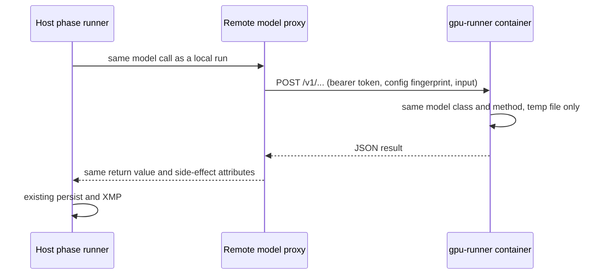

# Remote GPU runner

The GPU runner is a stateless HTTP service (`modules/remote_gpu/server.py`) in a Docker container on a machine with a GPU. A host phase routed to it keeps its normal flow (preprocessing, skip checks, persistence, XMP), and only the model forward pass crosses the network.

It is separate from the lease-worker design in [specs/remote-gpu-worker](../specs/remote-gpu-worker/INDEX.md) (#435). That design has the worker pull work and write Postgres itself; the runner opens no database at all.

## How it works



Each proxy in `modules/remote_gpu/proxies.py` subclasses the local model and overrides only its GPU method:

| Phase | Local class | Remote call | Input sent |
|---|---|---|---|
| `scoring` | `MultiModelHost.run_all_models` | `/v1/scoring/run_all_models` | The prepared file, after host RAW conversion and `scoring.model_preprocessing` |
| `keywords` | `KeywordScorer.predict`, `CaptionGenerator.generate` | `/v1/keywords/predict`, `/v1/keywords/caption` | The file the phase already reads (a thumbnail for RAW) |
| `culling` | MobileNetV2 `predict` in `ClusteringEngine` | `/v1/culling/embed` | The preprocessed float32 batch |
| `localization` | `BirdDetector._predict_raw_boxes`; `SceneClassifier` towers when `scene_route.enabled` | `/v1/detector/raw_boxes`, `/v1/localization/scene` | The decoded rendition, as lossless PNG |
| `bird_species` | `BioCLIPClassifier.classify` (and the bird-box rescan detector) | `/v1/bird_species/classify` | The upright decoded image, as lossless PNG |

The construction point is the only branch: `new_keyword_scorer()`, `new_caption_generator()`, `new_bioclip_classifier()`, `ClusteringEngine.load_model()`, `load_detector_context()`, `SceneRouter` and `ScoringRunner._init_shared_scorer()`. Cached models are rebuilt when `gpu_runner` switches a phase between `local` and `remote`, so no restart is needed. Scene scores are computed on the host from the runner's embeddings, after checking that both sides use the same prompt-set version. Box ranking, skip checks (`is_unchanged`), source hashes and `detector_config_hash` are all computed on the host, so a run is interchangeable with a local one. The runner reports its weights digest, which keeps `detector_config_hash` equal when both machines have the same weights.

## Set up the GPU machine

1. Clone this repo on the GPU PC.
2. Copy the host's `config.json` next to `docker-compose.gpu-runner.yml`. The runner rejects requests whose phase config differs from the host's (HTTP 409), and the host refuses to start the phase.
3. Seed `./models` from the host (`models/checkpoints`, `models/tfhub_cache`, detector weights). `.dockerignore` keeps `models/` and `config.json` out of the image, so the compose file bind-mounts both.
4. Start it with a long random token:

   ```powershell
   $env:GPU_RUNNER_TOKEN = "<token>"
   docker compose -f docker-compose.gpu-runner.yml up -d --build
   ```

5. Allow TCP `7870` from the host only (Windows firewall or LAN ACL). The token travels in a header; for TLS set `GPU_RUNNER_SSL_CERTFILE` / `GPU_RUNNER_SSL_KEYFILE` in the container and use `https://` on the host.

Runner environment: `GPU_RUNNER_TOKEN` (required unless bound to loopback), `GPU_RUNNER_HOST`, `GPU_RUNNER_PORT`, `GPU_RUNNER_MAX_BODY_MB` (default 256), `GPU_RUNNER_MAX_CONCURRENCY` (default 16; beyond it the runner answers 503 and the host backs off). Inference itself runs one request at a time.

## Configure the host

`secrets.json`:

```json
{ "gpu_runner": { "token": "<same token>" } }
```

`config.json` ([key reference](../technical/CONFIG.md)):

```json
"gpu_runner": {
  "enabled": true,
  "url": "http://gpu-pc:7870",
  "phases": { "scoring": "remote", "keywords": "remote", "culling": "local", "localization": "remote", "bird_species": "remote" },
  "request_timeout_seconds": 600
}
```

Phases left at `local` keep using this machine's GPU.

## Failure behaviour

- **Runner down or config drift at batch start:** the phase fails at model load with a message naming the unreachable URL or the differing config sections. Localization records `retryable_error` / `detector_unavailable` for the batch, the same as a local weights failure.
- **Connect error mid-batch:** retried once, since nothing reached the runner. **Read timeout:** not retried, because the runner may still be computing; that image fails.
- **503 busy:** retried after 1, 2 and 4 seconds.
- Nothing ever falls back to the local GPU.

## Limits

- API-backed registry scoring models (`cursor`, `claude`) would run on the runner, which has no `secrets.json`. Keep them inactive when scoring is remote.
- Large RAW previews travel as PNG (often 10–40 MB per image for localization and bird species). Use a wired LAN.

## Verify

```powershell
python -m pytest tests/test_remote_gpu_runner.py -q
```

Live check: route one folder's `scoring` to the runner and compare `image_model_scores` against a local run of the same images (they should match within float tolerance). Then run localization twice; the second run should report every image unchanged and write no new `is_current` rows.
