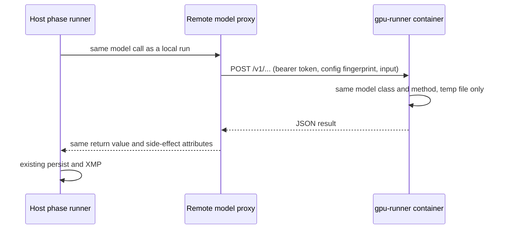

# Remote GPU runner

The GPU runner is a stateless HTTP service (`modules/remote_gpu/server.py`) in a Docker container on a machine with a GPU. A host phase routed to it keeps its normal flow (preprocessing, skip checks, persistence, XMP), and only the model forward pass crosses the network.

If the configured runner becomes unavailable, the host tries a runner on this machine, then (only when `fallback.embedded` is true) embedded inference in the host process. Both HTTP and embedded execution use `modules/remote_gpu/runtime.py`, so they run the same methods and return the same contract. Models for embedded fallback load only when it is first used; embedded inference is serialized across phases.

It is separate from the lease-worker design in [specs/remote-gpu-worker](../specs/remote-gpu-worker/INDEX.md) (#435). That design has the worker pull work and write Postgres itself; the runner opens no database at all.

## How it works



Each proxy in `modules/remote_gpu/proxies.py` subclasses the local model and overrides only its GPU method:

| Phase | Local class | Remote call | Input sent |
|---|---|---|---|
| `scoring` | `MultiModelHost.run_all_models` | `/v1/scoring/run_all_models` | The prepared file, after host RAW conversion and `scoring.model_preprocessing` |
| `keywords` | `KeywordScorer.predict`, `CaptionGenerator.generate`, accessibility CLIP ranking | `/v1/keywords/predict`, `/v1/keywords/caption`, `/v1/keywords/accessibility` | The file the phase already reads (a thumbnail for RAW); accessibility sends the prompt bank and optionally a stored image embedding |
| `culling` | MobileNetV2 `predict` in `ClusteringEngine` | `/v1/culling/embed` | The preprocessed float32 batch |
| `localization` | `BirdDetector._predict_raw_boxes`; `SceneClassifier` towers when `scene_route.enabled` | `/v1/detector/raw_boxes`, `/v1/localization/scene` | The decoded rendition, as lossless PNG |
| `bird_species` | `BioCLIPClassifier.classify` (and the bird-box rescan detector) | `/v1/bird_species/classify` | The upright decoded image, as lossless PNG |

The construction point is the only branch: `new_keyword_scorer()`, `new_caption_generator()`, `new_bioclip_classifier()`, `ClusteringEngine.load_model()`, `load_detector_context()`, `SceneRouter` and `ScoringRunner._init_shared_scorer()`. Cached models are rebuilt when `gpu_runner` switches a phase between `local` and `remote`, so no restart is needed. Scene scores are computed on the host from the runner's embeddings, after checking that both sides use the same prompt-set version. Box ranking, skip checks (`is_unchanged`), source hashes and `detector_config_hash` are all computed on the host, so a run is interchangeable with a local one. The runner reports its weights digest, which keeps `detector_config_hash` equal when both machines have the same weights.

## Set up the GPU machine

1. Clone this repo on the GPU PC.
2. Copy the host's `config.json` next to `docker-compose.gpu-runner.yml`. The runner rejects requests whose phase config differs from the host's (HTTP 409), and the host refuses to start the phase.
3. Seed `./models` from the host (`models/checkpoints`, `models/tfhub_cache`, detector weights). `.dockerignore` keeps `models/` and `config.json` out of the image, so the compose file bind-mounts both.
4. Start it with a long random token:

   ```powershell
   $env:GPU_RUNNER_TOKEN = "<token>"
   docker compose -f docker-compose.gpu-runner.yml up -d --build
   ```

5. Allow TCP `7870` from the host only (Windows firewall or LAN ACL). The token travels in a header; for TLS set `GPU_RUNNER_SSL_CERTFILE` / `GPU_RUNNER_SSL_KEYFILE` in the container and use `https://` on the host.

Runner environment: `GPU_RUNNER_TOKEN` (required unless bound to loopback), `GPU_RUNNER_HOST`, `GPU_RUNNER_PORT`, `GPU_RUNNER_MAX_BODY_MB` (default 256), `GPU_RUNNER_MAX_CONCURRENCY` (default 4 admitted requests; beyond it the runner answers 503 and the host backs off), `GPU_RUNNER_UPLOAD_TIMEOUT_SECONDS` (default 60 seconds to receive the whole upload), and `GPU_RUNNER_IDLE_EXIT_SECONDS` (default 0 = off; see [Idle recycle](#idle-recycle)). Inference itself runs one request at a time. Authentication, declared size, config fingerprint, and admission are checked before parsing an upload; streamed bytes are also capped. `/healthz` remains available without an inference admission slot.

To change these limits in Docker Compose, export the corresponding variable before starting the container. The concurrency limit includes requests waiting for inference and uploads still being received; choose it with the maximum body size and available RAM in mind.

## Configure the host

`secrets.json`:

```json
{ "gpu_runner": { "token": "<same token>" } }
```

`config.json` ([key reference](../technical/CONFIG.md)):

```json
"gpu_runner": {
  "enabled": true,
  "url": "http://gpu-pc:7870",
  "phases": { "scoring": "remote", "keywords": "remote", "culling": "local", "localization": "remote", "bird_species": "remote" },
  "request_timeout_seconds": 600,
  "fallback": {
    "enabled": true,
    "local_url": "http://127.0.0.1:7870",
    "embedded": false,
    "cooldown_seconds": 30,
    "max_cooldown_seconds": 300
  }
}
```

Phases left at `local` keep using this machine's GPU.

### Local fallback setup

1. Run the same GPU-runner Compose service on the host machine, with the same phase configuration, weights, and bearer token. `fallback.local_url` identifies this service. When the host application runs inside Docker and the fallback service publishes its port on Windows, use `http://host.docker.internal:7870` instead of the container's loopback address.
2. Optional, off by default: set `fallback.embedded` to `true` to allow embedded inference in the host process after both HTTP runners are unavailable. This loads every model the phase needs into the host (WebUI) process; prefer the local runner container. Install the normal inference dependencies and model weights in the host application's environment for embedded fallback. The existing GPU WebUI/gpu-shell image provides the inference stack. The embedded runner uses the host's normal model device selection; it requires enough RAM/VRAM to load the configured models.
3. Watch host logs for `gpu_runner: phase ... uses ... (fallback)`. An unavailable backend opens its circuit; repeated failures increase the cooldown exponentially from `cooldown_seconds` to `max_cooldown_seconds`, with jitter between half and all of that interval. Only one caller probes a backend after its cooldown; other callers keep using fallback. A successful probe restores the preferred backend and resets its failure count. No service is started automatically.

These fallback settings are the defaults even when omitted. Set `local_url` to an empty string to skip the local HTTP runner, `embedded` to `true` to allow loading models in the host, or `enabled` to `false` to restore strict remote-only behavior. The local service and embedded host must use the same detector weights for a localization context to remain valid during failover.

### Decoupled host

To keep all inference out of the WebUI process, run the gpu-runner service next to the WebUI and take the GPU away from the WebUI. `docker-compose.decoupled.yml` does both: it includes `docker-compose.gpu-runner.yml` and resets the WebUI's `gpus`/`deploy` GPU reservation. Enable it per machine in the git-ignored `.env`, together with the runner token (the same value as `gpu_runner.token` in the host secrets file):

```dotenv
COMPOSE_FILE=docker-compose.yml;docker-compose.decoupled.yml
GPU_RUNNER_TOKEN=<runner token>
GPU_RUNNER_IDLE_EXIT_SECONDS=600
```

Use `:` instead of `;` as the separator on Linux/WSL. Then point the fallback at the service on the Compose network and route every phase to the pool:

```json
"gpu_runner": {
  "enabled": true,
  "url": "http://gpu-pc:7870",
  "phases": { "scoring": "remote", "keywords": "remote", "culling": "remote", "localization": "remote", "bird_species": "remote" },
  "fallback": { "enabled": true, "local_url": "http://gpu-runner:7870", "embedded": false }
}
```

Without a second GPU PC, set `url` to `http://gpu-runner:7870` and leave `local_url` empty. Phases left at `local` still run in the WebUI process, now on CPU. With every phase remote the WebUI does not import TensorFlow or PyTorch for inference.

### Idle recycle

A runner keeps every model it has loaded, and TensorFlow and CUDA return memory only when the process exits. With `GPU_RUNNER_IDLE_EXIT_SECONDS` set, the runner exits cleanly once that many seconds pass without inference after it has run a model; `restart: unless-stopped` brings it back empty, and models load again on the next request. Health and other non-inference requests do not count as activity. While it restarts, hosts see the runner as unavailable and use the next backend.

### Retry and timeout policy

Safe retries use exponential delays with full jitter: up to 1, 2, and 4 seconds by default, capped by `retry.max_delay_seconds` (8 seconds). There are at most `retry.max_retries` (3) retries per HTTP operation. A 30-second `retry.budget_seconds` limits scheduling retries; connection/pool waits on retries are clipped to the remaining budget. The budget does not cancel an admitted inference. `429`/`503` admission refusals honor `Retry-After` (seconds or HTTP date). If the requested wait exceeds the remaining budget, the host falls back and does not probe that backend before the server's requested time.

HTTP I/O timeouts are configured under `gpu_runner.timeouts`: `connect_seconds` (5), `health_seconds` (5), `write_seconds` (60), and `pool_seconds` (5). Inference reads use `request_timeout_seconds` (600). `max_connections` (4) bounds each HTTP connection pool. Embedded callers also have a bounded admission wait using `pool_seconds`; once embedded inference starts, it is synchronous and cannot be forcibly interrupted. Use the local HTTP service when process isolation and client timeouts are required.

Model configuration changes after embedded loading require a host restart. Restart the host after changing transport/fallback settings if phase proxies are already cached; newly constructed clients use the updated settings immediately.

## Failure behaviour

- **Runner down at batch start or mid-batch:** connection failures advance through the fallback chain. If every permitted backend is unavailable, the phase fails. Embedded model failures surface with the embedded endpoint and failure detail.
- **Config drift, authentication failure, incompatible API, or invalid output:** the phase fails instead of changing backends. These errors need correction; fallback does not bypass them.
- **Worker model config edited after startup:** health reports the affected phases under `restart_required`; requests for those phases return HTTP 409 until the worker restarts. This prevents cached models from being advertised with newer settings. The host also rejects incompatible API versions before starting a phase.
- **Connect or connection-pool failure:** bounded exponential retries, then fallback, since nothing reached the runner. **Inference read/write timeout or broken connection after submission:** no retry or fallback for that image, because inference may still be running. The backend enters cooldown so subsequent images can use fallback. A failed health probe can fall back before submitting inference.
- **429 rate limit / 503 busy:** bounded exponential retries with jitter and `Retry-After`, then fallback. A completed worker error (`500` with the worker's error envelope) can also fall back; gateway `502`/`504` responses remain ambiguous and fail the submitted image.
- **Invalid upload:** malformed lengths return 400, missing lengths 411, excessive bodies 413, and upload deadlines 408. Malformed metadata returns 422. Invalid, empty, or nonfinite scoring results fail before host persistence.
- **Localization identity:** before a fallback detector runs, its weights digest and version must match the active context. Different weights fail the image rather than persisting boxes under the original detector identity.
- **Embedded config edited after models load:** restart the host to apply it; embedded execution rejects stale model settings as the HTTP worker does.

## Limits

- API-backed registry scoring models (`cursor`, `claude`) would run on the runner, which has no `secrets.json`. Keep them inactive when scoring is remote.
- Large RAW previews travel as PNG (often 10–40 MB per image for localization and bird species). Use a wired LAN.

## Verify

```powershell
docker exec image-scoring-gpu-shell python -m pytest tests/test_remote_gpu_runner.py tests/test_remote_gpu_hardening.py tests/test_remote_gpu_fallback.py tests/test_remote_gpu_resilience.py tests/test_clip_accessibility.py -q
```

Live check: route one folder's `scoring` to the runner and compare `image_model_scores` against a local run of the same images (they should match within float tolerance). Then run localization twice; the second run should report every image unchanged and write no new `is_current` rows.

For failover, stop the remote service and verify that the host logs selection of the local HTTP runner. If `fallback.embedded` is enabled, stop the local runner and verify embedded inference with the same inputs. Restart the remote service, wait for the cooldown, and verify that the next inference returns to it. Compare output and host persistence across all three modes. Use a small folder and identical detector weights for this live check.
