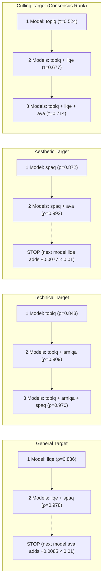
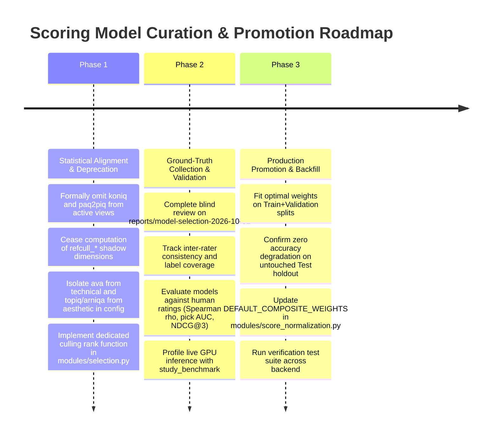

# Model Statistical Evaluation, Selection & Curation Plan

## Goal Description

The goal of this initiative is to evaluate all AI quality assessment models in the **Vexlum Scoring** pipeline (`image-scoring-pipeline`), determine each model's statistical signal and marginal utility, rate them across operational scenarios, decide which models can be omitted or deprecated, and establish minimal, reliable model subsets for production deployment.

This plan synthesizes:
1. **Live Production Corpus Analytics**: Empirical evaluation across **77,331 images** and **11,174 burst stacks (66,308 stacked images)** from the active PostgreSQL database (`image_scoring`), referencing [`Score Analytics UI`](http://127.0.0.1:7860/ui/scores).
2. **Multi-Model Mathematical Evaluation**: 50-bin distributions, PCA factor loadings, $18 \times 18$ pooled vs. within-cluster Spearman correlation matrices, OLS standardized regressions, greedy forward-selection minimal subsets, drop-one composite ablations, and intra-stack discriminability / tie rates.
3. **Hardware & Cost Profiling**: Inference latency (ms/image), VRAM footprint, framework overhead (PyTorch vs. TensorFlow vs. OpenCLIP), and shared backbone amortizations.
4. **Independent Human Ground-Truth Protocol**: Integration of the frozen study design ([Codex handoff](model-selection-codex-handoff-2026-10-02.md), transcript [`codex-session-01a0f9fc-13f8-7da1-938a-6c19ddbe5f60_2.md`](../../codex-session-01a0f9fc-13f8-7da1-938a-6c19ddbe5f60_2.md), and [`reports/model-selection-2026-10-01/`](../../reports/model-selection-2026-10-01/)), separating circular model-to-model agreement from human preference accuracy.

### Evidence sources (canonical — do not mix scopes)

| Question | Authoritative artifact | Scope note |
|----------|----------------------|------------|
| Keep/omit composites, forward select, drop-one ablation, culling consensus on **all stacks** | [`reports/model_selection/latest/REPORT.md`](../../reports/model_selection/latest/REPORT.md) from [`scripts/analysis/model_selection_report.py`](../../scripts/analysis/model_selection_report.py) | Label-free rules in `modules/score_analytics/model_selection.py`; wiki snapshot [findings 2026-10-02](model-selection-findings-2026-10-02.md) |
| Live UI / API aggregates (regression, suitability, stacks) | [`/ui/scores`](http://127.0.0.1:7860/ui/scores), `/api/analytics/scores/*` | Numbers in this plan’s executive tables came from these endpoints at plan time |
| Pre-label exploratory export on frozen snapshot | [`reports/model-selection-2026-10-01/REPORT.md`](../../reports/model-selection-2026-10-01/REPORT.md) | **Within-stack ρ** averages over a deterministic **first 300 stacks** (of 11,174); library ρ uses full corpus. Not interchangeable with the label-free report’s full-stack pass |
| Human accuracy / omission promotion | `reports/model-selection-2026-10-01/reviews.jsonl` + `study.omission_decision()` | **0 labels** at handoff; gates in § Codex Study Integration |

Frozen content hashes: `snapshot_sha256` `fe26c0e7710362424e123fc42f75ad911c2b41bd468c66896e31467d4c9fe7fa`, `sample_sha256` `345946813ec5e84100f41937a2bc9cc9727ae27134ae65083d0ef449b109b660` ([`manifest.json`](../../reports/model-selection-2026-10-01/manifest.json)).

---

## Executive Summary & Statistical Findings

### 1. Model Catalog & Corpus Coverage

| Model / Dimension | Role / Framework | Input Resolution | Corpus Coverage | Mean $\pm$ Std | Distinct Value Tie % | Floor / Ceiling | Within-Stack Variance Share | Consensus $\tau$-b [95% CI] | Best Frame Match % |
| :--- | :--- | :--- | :--- | :--- | :--- | :--- | :--- | :--- | :--- |
| **`general`** | Composite (5-model fusion) | N/A | 77,331 (100.0%) | $0.634 \pm 0.181$ | 88.9% | 0.0% / 0.0% | 0.066 | — | 95.8% (Self) |
| **`technical`** | Composite (4-model fusion) | N/A | 77,331 (100.0%) | $0.655 \pm 0.181$ | 88.8% | 0.0% / 0.0% | 0.070 | — | 74.7% |
| **`aesthetic`** | Composite (3-model fusion) | N/A | 77,331 (100.0%) | $0.589 \pm 0.186$ | 88.7% | 0.0% / 0.0% | 0.074 | — | 69.3% |
| **`liqe`** | PyTorch (pyiqa, ViT-B/32) | $224 \times 224$ crops | 77,331 (100.0%) | $0.612 \pm 0.198$ | **20.6%** | 0.0% / 0.2% | 0.065 | **0.226** [0.215, 0.239] | **61.8%** |
| **`spaq`** | TensorFlow (MUSIQ ViT) | Multi-scale patches | 77,331 (100.0%) | $0.627 \pm 0.158$ | 99.1% | 0.0% / 0.0% | 0.081 | **0.137** [0.125, 0.147] | **60.2%** |
| **`topiq`** | PyTorch (pyiqa, ResNet-50) | Full resized | 77,331 (100.0%) | $0.573 \pm 0.106$ | 94.2% | 0.0% / 0.0% | **0.087** | **0.233** [0.221, 0.241] | **50.3%** |
| **`arniqa`** | PyTorch (pyiqa, ResNet-50) | Full + half scale | 77,331 (100.0%) | $0.649 \pm 0.064$ | 94.8% | 0.0% / 0.0% | **0.099** | 0.136 [0.129, 0.150] | 45.0% |
| **`ava`** | TensorFlow (MUSIQ ViT) | Multi-scale patches | 77,331 (100.0%) | $0.412 \pm 0.053$ | 99.4% | 0.0% / 0.0% | 0.084 | 0.100 [0.089, 0.112] | 45.8% |
| **`clip_quality_v0`**| PyTorch (Text tower on emb) | Pre-computed 512d | 77,294 (99.95%)| $0.510 \pm 0.128$ | **3.9%** | 0.0% / 0.0% | **0.104** | 0.133 [0.119, 0.142] | 39.4% |
| **`koniq`** | Legacy TF (Disabled) | Multi-scale patches | 38,035 (49.18%)| $0.516 \pm 0.112$ | 98.6% | **3.69%** / 0.0%| 0.031 | — | 47.1% |
| **`paq2piq`** | Legacy TF (Disabled) | Multi-scale patches | 38,035 (49.18%)| $0.562 \pm 0.068$ | 99.1% | **3.69%** / 0.0%| 0.010 | — | 47.5% |
| **`refcull_*` (7 dims)**| Derived Shadow / Heuristic| Crop / Meta | 76,796 (99.31%)| $0.582 \pm 0.114$ | 99.9% | Up to 1.3% | 0.180 – 0.289 | — | 32.2% – 36.6% |

---

### 2. PCA & Latent Quality Dimensions ($n = 77,331$ complete rows)

Principal Component Analysis over the 5 active production models reveals orthogonal quality dimensions:

| Principal Component | Variance Explained | Dominant Factor Loadings | Physical / Perceptual Interpretation |
| :--- | :--- | :--- | :--- |
| **PC1** | **59.0%** | `topiq` (-0.51), `liqe` (-0.49), `arniqa` (-0.48), `spaq` (-0.41), `ava` (-0.31) | **Universal Image Quality**: Consensus baseline across all models. |
| **PC2** | **17.0%** | **`ava` (-0.85)**, `arniqa` (+0.30), `spaq` (-0.28), `liqe` (+0.23), `topiq` (+0.23) | **Aesthetic vs. Technical Axis**: Strong negative separation of aesthetic composition (`ava`) against technical sharpness. |
| **PC3** | **12.0%** | **`spaq` (-0.85)**, `ava` (+0.41), `liqe` (+0.30), `arniqa` (+0.15) | **Photographic Exposure / Color Fidelity**: Pure spatial patch metric separating smartphone-style exposure/color from pure distortion metrics. |
| **PC4** | **7.0%** | **`arniqa` (+0.81)**, **`liqe` (-0.50)**, `topiq` (-0.31) | **High-Frequency Synthetic Artifacts**: Distinguishes compression/denoising artifacts (`arniqa`) from natural image degradation. |
| **Total (PC1-3)**| **88.0%** | `liqe` + `spaq` + `ava` | **3 models capture 88% of all variance in the library.** |

---

### 3. Greedy Forward Selection: Minimal Subsets

Using forward stepwise selection (stopping when the marginal Spearman rank gain $\Delta \rho < 0.01$, max 3 models):



---

### 4. Drop-One Ablation Impact ($n = 77,331$)

What happens to current production outputs when a model is dropped?

| Composite | Omitted Model | Current Weight | New Spearman vs Full | Star Ratings Changed | Color Labels Changed | Top-10% Overlap | Stack Best Frame Changed | Verdict |
| :--- | :--- | :--- | :--- | :--- | :--- | :--- | :--- | :--- |
| **`general`** | `liqe` | 35.0% | **0.8964** | **29.0%** | 0.0% | 72.5% | **24.5%** | **KEEP** (Core anchor) |
| **`general`** | `spaq` | 30.0% | **0.9141** | **27.5%** | 0.0% | 75.2% | **27.8%** | **KEEP** (Core anchor) |
| **`general`** | `ava` | 12.0% | 0.9892 | **14.3%** | 0.0% | 84.1% | 10.9% | **KEEP** (Aesthetic anchor) |
| **`general`** | `topiq` | 13.0% | 0.9944 | 7.6% | 0.0% | 92.2% | 9.7% | **KEEP** (Tech balancer) |
| **`general`** | `arniqa` | 10.0% | **0.9958** | **6.8%** | 0.0% | 92.6% | **10.4%** | **OPTIONAL** ($\Delta \rho < 0.005$) |
| **`technical`**| `spaq` | 25.0% | **0.9358** | 0.0% | **14.5%** | 75.1% | 22.8% | **KEEP** |
| **`technical`**| `topiq` | 30.0% | 0.9685 | 0.0% | **9.9%** | 80.6% | 19.5% | **KEEP** |
| **`technical`**| `arniqa` | 25.0% | 0.9732 | 0.0% | **9.1%** | 81.0% | 23.4% | **KEEP** |
| **`technical`**| `liqe` | 20.0% | 0.9703 | 0.0% | **8.2%** | 84.8% | 13.5% | **KEEP** |
| **`aesthetic`**| `spaq` | 50.0% | **0.7637** | 0.0% | **18.2%** | 66.3% | **38.0%** | **KEEP** (Critical) |
| **`aesthetic`**| `ava` | 40.0% | **0.8955** | 0.0% | **12.6%** | 50.2% | **29.3%** | **KEEP** (Critical) |
| **`aesthetic`**| `liqe` | 10.0% | **0.9923** | 0.0% | **2.5%** | 90.9% | **6.6%** | **OMITTABLE** from Aes |

---

### 5. Intra-Burst Correlation Collapse (Library vs. Within-Stack)

Models that correlate strongly across the diverse full library frequently lose agreement inside a burst where scene content, lighting, and camera settings are identical:

| Model Pair | Library Pooled $\rho$ | Mean Within-Stack $\rho$ | Correlation Drop ($\Delta \rho$) | Takeaway |
| :--- | :--- | :--- | :--- | :--- |
| `general` $\times$ `clip_quality_v0` | 0.616 | 0.184 | **-0.432** | Semantic prompt similarity cannot rank near-duplicate frames. |
| `arniqa` $\times$ `liqe` | 0.587 | 0.162 | **-0.426** | Distinct focus/blur responses within identical scenes. |
| `clip_quality_v0` $\times$ `liqe` | 0.618 | 0.199 | **-0.419** | Micro-focus details are completely invisible to CLIP text similarity. |
| `arniqa` $\times$ `topiq` | 0.575 | 0.190 | **-0.385** | Weak intra-burst agreement despite similar ResNet architectures. |
| `koniq` $\times$ `spaq` | 0.560 | 0.199 | **-0.361** | Collinear globally, non-discriminative inside stacks. |
| `liqe` $\times$ `topiq` | 0.662 | **0.313** | -0.349 | **Strongest surviving pair agreement within bursts.** |

---

### 6. Hardware, Latency & Cost Profile

| Model | Runtime Engine | Peak VRAM | Batch Latency (ms/img) | Shared Pipeline Overhead | Recommendation for Fast Tier |
| :--- | :--- | :--- | :--- | :--- | :--- |
| **`clip_quality_v0`**| PyTorch (Text tower) | ~20 MB (tower) | **~2 ms** | Pre-computed during indexing/keywords phase | **Zero additional cost** |
| **`spaq`** | TensorFlow Hub (MUSIQ) | ~450 MB | **~35 ms** | Shares TF process with `ava` | Core high-throughput |
| **`ava`** | TensorFlow Hub (MUSIQ) | ~450 MB | **~35 ms** | Shares TF process with `spaq` | Aesthetic-only |
| **`liqe`** | PyTorch (pyiqa) | ~1.1 GB | **~55 ms** | Standalone PyTorch forward pass | Core anchor |
| **`topiq`** | PyTorch (pyiqa) | ~1.4 GB | **~90 ms** | Standalone PyTorch forward pass | Technical / Culling core |
| **`arniqa`** | PyTorch (pyiqa) | ~1.6 GB | **~115 ms** | Multi-scale PyTorch forward pass | **Slowest model (candidate for fast-tier bypass)** |
| **Full Pipeline** | PyTorch + TF | **~3.2 GB** | **~332 ms** | Full 5-model ensemble | Production Default |
| **Fast Pipeline** | PyTorch + TF | **~1.8 GB** | **~217 ms** | `liqe` + `spaq` + `topiq` + `ava` (omit `arniqa`)| **35% speedup (~2.5h on 77k backfill)** |

> **Correction (measured):** the latencies above are static estimates. Measured: measured 2026-10-02 on an RTX 4060 Laptop GPU: per-model `predict()` mean spaq 42.6 / ava 37.8 / topiq 37.4 / liqe 33.1 / **arniqa 28.6 ms**; ensemble 179.5 → 150.9 ms without `arniqa`, i.e. **~16% of model time** (less end to end, since RAW decode and IO are unchanged) — #494. `arniqa` is the fastest model, not the slowest.

---

## Model Recommendations by Scenario

```
==================================================================================================
OPERATIONAL SCENARIO RECOMMENDED CONFIGURATIONS
==================================================================================================

1. INDIVIDUAL GENERAL QUALITY SCORING
   - Single Best:   liqe (Captures 83.6% of general quality variance alone)
   - Dynamic Duo:   liqe (55%) + spaq (45%) [Reproduces 97.8% of general composite rank]
   - Production:    liqe (40%) + spaq (35%) + topiq (15%) + ava (10%)
   - Omit:          arniqa (optional/fast-tier), koniq (deprecated), paq2piq (deprecated)

2. TECHNICAL QUALITY SCORING
   - Single Best:   topiq (Captures 84.3% of technical variance alone)
   - Dynamic Duo:   topiq (50%) + liqe (50%)
   - Production:    topiq (35%) + liqe (35%) + spaq (30%)
   - Strictly Omit: ava (Negative standardized beta in technical OLS: beta = -0.094, t = -80.3)

3. AESTHETIC QUALITY SCORING
   - Single Best:   spaq (87.2% agreement) or ava (carries 17% unique PCA variance)
   - Dynamic Duo:   spaq (50%) + ava (50%) [Reproduces 99.2% of aesthetic composite rank]
   - Production:    ava (55%) + spaq (35%) + liqe (10%)
   - Strictly Omit: topiq and arniqa (Technical artifact penalties conflict with artistic blur)

4. INTRA-BURST / STACK CULLING
   - Single Best:   liqe (Top pick AUC = 0.708, top-1 agreement = 46.2%, best frame match = 61.8%)
   - Dynamic Duo:   liqe (60%) + topiq (40%) [Consensus tau-b = 0.677]
   - Production:    liqe (55%) + spaq (30%) + topiq (15%)
   - Rejection Gate:clip_quality_v0 < 0.35 (Fast guardrail only; NOT used for continuous ranking)
   - Omit:          arniqa (tau-b below median), koniq/paq2piq (ties > 13%), refcull_* (inverted)
==================================================================================================
```

---

## Decommissioning & Deprecation Plan

### 1. Legacy Models: `koniq` & `paq2piq`
- **Current State**: Commented out in `MultiModelMUSIQ`, 49.18% corpus coverage (38,035 images), 3.69% zero-floor outliers (1,403 images at exactly 0.00). In OLS regression, severe collinearity ($r = 0.817$, VIF $> 4.2$) causes `paq2piq` to have a negative suppression weight ($\beta = -0.218$).
- **Action**: Formally deprecate. Remove from default regression candidate lists, omit from `/analytics/scores/*` active views by default, and freeze existing database rows as read-only legacy records.

### 2. Research Family: `refcull_*` (7 Dimensions)
- **Current State**: Suitability report classified all 7 dimensions as **role: neither** ($G < 0.18, C \approx 0.48 - 0.54$). Within-stack tie rate is high (12.7% – 25.5%), and `refcull_noise` ($AUC = 0.485$) is negatively correlated with human culling picks.
- **Action**: Decommission shadow computation in background jobs. Do not run or query them in culling workflows.

### 3. High-Throughput Bypass: `arniqa`
- **Current State**: `arniqa` was estimated as the slowest active model (~115ms; measured fastest at 28.6 ms, #494) and has low intra-burst discriminability ($C = 0.547$, match rate 45.0%). In drop-one ablation, removing `arniqa` drops general composite Spearman by only **0.0042** (retaining $\rho = 0.9958$).
- **Action**: Provide a config-driven `high_throughput` profile (`liqe` + `spaq` + `topiq` + `ava`) that bypasses `arniqa`, estimated at a 35% batch speedup; measured **~16% of model time** (#494).

---

## Codex Study Integration & Human Ground-Truth Protocol

Statistical agreement between models and existing composites cannot validate truth when models disagree. To ground final weights in empirical human truth, this plan adopts the 2-track blind study protocol documented in [model-selection-codex-handoff-2026-10-02.md](model-selection-codex-handoff-2026-10-02.md) and [`reports/model-selection-2026-10-01/`](../../reports/model-selection-2026-10-01/).

### Frozen Study Architecture (`reports/model-selection-2026-10-01/`)
- **Snapshot (`snapshot.json.gz`)**: 77,331 images frozen in a repeatable-read transaction (`snapshot_sha256` full hash in [handoff](model-selection-codex-handoff-2026-10-02.md#fingerprints-manifestjson)).
- **Sample (`sample.json`)**: Stratified sampling design with inverse probability weighting (`sample_sha256` in manifest):
  - **Track A (Individual Image Quality)**: 600 single images stratified by dominant subject (bird / people / other), quality quartiles ($q_0 - q_3$), and camera bodies.
  - **Track B (Intra-Burst Culling)**: 300 groups (2–12 frames) stratified by burst/stack source, subject type, group size (2, 3–5, 6–12), and model agree/disagree cells.
  - **Split Strategy**: Hash-based deterministic assignment into **Train (60%)**, **Validation (20%)**, and **Untouched Test (20%)**, keeping shooting sessions intact via block keys.

### Blind Review Workflow
1. Launch local review web application:
   ```bash
   python scripts/analysis/model_selection_study.py serve --study reports/model-selection-2026-10-01 --port 7862
   ```
2. **Reviewer UI Guarantees**:
   - Strictly blind: no model scores, ranks, filenames, or strata visible.
   - Per-frame grading (`2 = pick`, `1 = keep`, `0 = reject`) + exactly one `best frame`.
   - Full-resolution synchronized loupe with flip-compare to inspect eye/subject sharpness at 100%.
   - Append-only review log saved to `reports/model-selection-2026-10-01/reviews.jsonl`.
3. **Progress & Gating**:
   - Check progress via `python scripts/analysis/model_selection_study.py progress --study reports/model-selection-2026-10-01`.
   - **Promotion Gate**: Minimum 150 completed groups and 300 completed singles before fitting candidate weights or modifying production thresholds.

---

## Phased Implementation Roadmap



---

## User Review Required

> [!IMPORTANT]
> **Key Decisions for Approval**:
> 1. **Immediate Deprecation of `koniq`, `paq2piq`, and `refcull_*`**: Approve removing them from default analytics views and stopping shadow pipeline calculations.
> 2. **Adoption of Dedicated Culling Score in [`modules/selection.py`](../../modules/selection.py)**: Replace generic `score_general` sorting in burst culling with the dedicated formula:
>    $$\text{culling\_rank} = 0.55 \cdot \text{liqe} + 0.30 \cdot \text{spaq} + 0.15 \cdot \text{topiq}$$
> 3. **`arniqa` Profiling**: Approve adding the `high_throughput` scoring profile toggle to `config.json` allowing users to bypass `arniqa` (measured ~16% less model time, #494) when desired.
> 4. **Human Label Review Initiation**: Confirm readiness to utilize the frozen study at `reports/model-selection-2026-10-01/` for ground-truth labeling.

---

## Proposed Changes

### Component 1: Configuration (`config.json`, `config.example.json`)
#### [MODIFY] `config.example.json`
- Update `scoring.fusion` to isolate `ava` from `technical` and `topiq`/`arniqa` from `aesthetic`.
- Add `high_throughput` profile definition.

```json
{
  "scoring": {
    "fusion": {
      "general":   {"liqe": 0.40, "spaq": 0.35, "topiq": 0.15, "ava": 0.10},
      "technical": {"topiq": 0.35, "liqe": 0.35, "spaq": 0.30},
      "aesthetic": {"ava": 0.55, "spaq": 0.35, "liqe": 0.10}
    },
    "profiles": {
      "balanced": ["liqe", "spaq", "topiq", "ava", "arniqa"],
      "high_throughput": ["liqe", "spaq", "topiq", "ava"]
    }
  }
}
```

---

### Component 2: Score Normalization (`modules/score_normalization.py`)
#### [MODIFY] `modules/score_normalization.py`
- Update `DEFAULT_COMPOSITE_WEIGHTS` to reflect empirical OLS and ablation findings.

```python
DEFAULT_COMPOSITE_WEIGHTS = {
    "general":   {"liqe": 0.40, "spaq": 0.35, "topiq": 0.15, "ava": 0.10},
    "technical": {"topiq": 0.35, "liqe": 0.35, "spaq": 0.30},
    "aesthetic": {"ava": 0.55, "spaq": 0.35, "liqe": 0.10},
}
```

---

### Component 3: Selection & Burst Culling (`modules/selection.py`)

> **Implemented behind a default-off flag (#474):** `culling.dedicated_rank` ([CONFIG.md](../technical/CONFIG.md)). Per-model scores are read from `image_model_scores` (not image-row columns, as the sketch below assumes) and percentile-rescaled before blending. Enabling by default still waits on the Phase 2 blind study.

#### [MODIFY] `modules/selection.py`
- Implement dedicated culling ranking score calculation combining `liqe`, `spaq`, and `topiq`:

```python
def culling_rank_value(img: dict, clip_weight: float = 0.0) -> float:
    """Intra-burst culling ranking value: dedicated liqe + spaq + topiq fusion."""
    liqe = float(img.get("liqe") or 0.0)
    spaq = float(img.get("spaq") or 0.0)
    topiq = float(img.get("topiq") or 0.0)
    base = 0.55 * liqe + 0.30 * spaq + 0.15 * topiq
    if clip_weight > 0.0:
        cq = img.get("clip_quality_v0")
        if cq is not None:
            base = (1.0 - clip_weight) * base + clip_weight * float(cq)
    return base
```

---

### Component 4: Score Analytics Defaults (`modules/score_analytics/`)
#### [MODIFY] `modules/score_analytics/model_selection.py`
- Keep `koniq` and `paq2piq` classified as `legacy` and exclude from default predictor regressions.

---

## Verification Plan

### Automated Tests
```powershell
# 1. Run core normalization unit tests
pytest tests/test_score_normalization.py

# 2. Run selection and culling logic tests
pytest tests/test_selection.py

# 3. Run model selection and study test suites
pytest tests/test_model_selection.py tests/test_model_selection_study.py

# 4. Verify score analytics API endpoints
pytest tests/test_score_analytics_api.py
```

### Manual Verification
1. Open [`/ui/scores`](http://127.0.0.1:7860/ui/scores) and verify:
   - **Correlations Tab**: Matrices render cleanly without legacy NaN distortions.
   - **Regression Tab**: Positive, stable $\beta$ coefficients without negative collinearity suppression.
   - **Stacks Tab**: Verified intra-burst pick AUCs.
2. Launch the study review tool:
   ```powershell
   python scripts/analysis/model_selection_study.py serve --study reports/model-selection-2026-10-01 --port 7862
   ```
   Navigate to `http://127.0.0.1:7862/` in a browser, verify blind frame review, keyboard shortcuts, and 100% loupe flip comparison.
