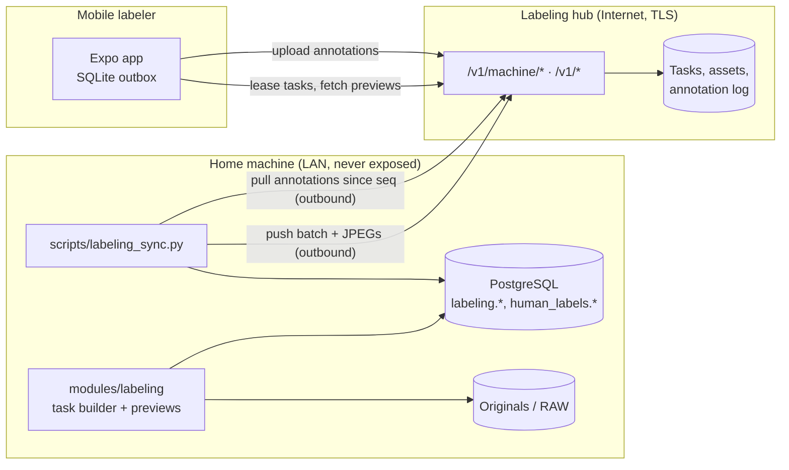

# Human labeling sync 01: architecture

**Epic:** #454 · **Hub:** [INDEX.md](INDEX.md)

## Summary

The local backend stays the **source of truth**: library, Postgres, experiment definitions, samples and imported labels. The hub is a **broker**. It holds only what phones need (tasks and preview JPEGs) and what phones produce (annotation events), and it can be wiped and rebuilt from the backend at any time, apart from annotations that have not been pulled yet.

## Today

**Backend (this repo, master):**
- No labeling code, schema or endpoints.
- `human_labels` exists only in the operator's database. No module or Alembic migration creates it: a grep for `human_labels` in `*.py` finds nothing. The first 20 labelled groups live there ([human-culling-labels.md §Status](../../planning/human-culling-labels.md#status-2026-09-25)).
- The label audit (`modules/score_analytics/labels.py:5`) counts only `culling_picks` rows with `auto_suggested = 0` as independent human labels.
- `images.image_uuid` exists, with the partial unique index `uq_images_image_uuid` (`modules/db_postgres.py:575`, `:611`).

**Mobile repo (`cursor/mobile-labeler-mvp-fc18` @ `f4feb84`):**
- An offline-first Expo app with `culling`, `binary` and `pairwise` screens, a SQLite outbox and background upload.
- A dev hub (`labeling-hub/`, Hono + SQLite) with bearer tokens for mobile and machine clients. Previews are remote URLs; there is no asset storage.

## Components

| Side | Component | Status | Role |
|---|---|---|---|
| Backend | Postgres `labeling` schema + `human_labels` | new (M1) | Experiments, batches, tasks, raw events, cursors, preview asset index. `human_labels` comes under Alembic ([03](03-storage-and-import.md)). |
| Backend | `modules/labeling/` | new (M2–M3) | `experiments` (definitions), `task_builder` (unit → task), `previews` (blind JPEG rendering), `importer` (events → projection), `repository` (SQL) |
| Backend | `scripts/labeling_sync.py` | new (M4) | Sync agent CLI: `push-batch`, `pull-annotations`, `status` ([04](04-sync-and-rollout.md)) |
| Backend | Webui / REST API | unchanged in M1–M4 | Stays on `127.0.0.1`. Read-only labeling endpoints (progress, agreement) are a later, separate contract change. |
| Hub | Labeling hub | exists as a dev service; v1 changes in M4 | Batches, leases, asset store, annotation store with a hub-assigned sequence |
| Mobile | Labeler app | exists; changes in M4–M5 | Consumes `LabelTask`, produces `AnnotationEvent` |

## Data flow

1. **Build.** The operator runs `labeling_sync.py push-batch --experiment <id>`. The task builder selects units, for example from `human_labels.units` in `sample_order`, skipping units already done by the target labeler. It renders one preview per image and writes `labeling.batches` and `labeling.tasks`.
2. **Push.** The agent uploads any preview whose SHA-256 the hub lacks, then upserts the batch manifest, whose tasks reference hub asset URLs.
3. **Label.** The phone leases tasks, caches previews, labels offline and uploads events. The hub stamps `labelerId` and a monotonic `seq` on each event.
4. **Pull.** `labeling_sync.py pull-annotations` reads events after the stored cursor and inserts them into `labeling.annotation_events` (`ON CONFLICT DO NOTHING`). It then advances the cursor in the same transaction.
5. **Project.** The importer recomputes current answers per (task, labeler) and, for experiments bound to #415, upserts `human_labels.labels` and `human_labels.unit_status`.

## Trust boundaries

1. **Backend → hub (Internet).**
   - HTTPS only in production.
   - A machine token, stored in `secrets.json` and never in `config.json`.
   - Every connection is outbound from the home machine. No port forward and no LAN exposure.
2. **What crosses to the hub is allow-listed**, never filtered from a larger record:
   - `imageId` (opaque, D-1), the preview JPEG, capture order within a unit, task and experiment ids, the question and choices.
   - **Never** file paths, filenames, folder names, EXIF, GPS, camera serials, model scores, ranks, strata or weights.
   - Preview JPEGs are re-encoded with no metadata, which strips GPS. That rule applies even to experiments that show scores, which are a later opt-in with `presentation.show_scores`.
3. **Hub → backend: annotations are untrusted input.**
   - Validate the schema version, the task id (it must exist in `labeling.tasks`), that each image id belongs to the task, and that the choice is in `config.choices`.
   - Quarantine failures in `labeling.annotation_rejects` instead of dropping them silently.
4. **Phone → hub:** a per-labeler token (D-3). A leaked phone token can add annotations under that labeler only. It cannot read other labelers' events or push batches.

## Image identity

The hub and phone see one string `imageId` per item.

| Option | For | Against |
|---|---|---|
| **`images.image_uuid`** (recommended) | Already unique and opaque. Stable across `images.id` renumbering when rows are rebuilt. The `deleted_images.image_uuid` column allows tracing after deletion. | Nullable today, so it needs a backfill for sampled images (M1). |
| `images.id` | Always present | Leaks library size and order. Changes when rows are re-created. |
| HMAC(`id`) | Opaque | Needs a secret and a lookup table, and adds nothing over the UUID. |

The importer resolves `imageId` back to `images.id` at import time. An unknown UUID is quarantined, never auto-created.

## Failure model

| Failure | Effect | Recovery |
|---|---|---|
| Phone offline for days | Events wait in the phone outbox. | Uploaded later. The hub `seq` orders them by **arrival**, so a cursor never skips them (see [04 §Cursor](04-sync-and-rollout.md#cursor)). |
| Pull interrupted | Events are inserted, but the cursor is not advanced. | The next pull re-reads them, and `ON CONFLICT DO NOTHING` makes that harmless. |
| Hub wiped | Tasks and assets are lost. | `push-batch --resume <batch>` re-pushes from `labeling.*`. Only events that were never pulled are lost, which is why pulls run on a schedule. |
| Image deleted or re-indexed after push | The event references a UUID with no live `images` row. | Quarantine with reason `image_missing`. `deleted_images.image_uuid` lets an operator trace it. |
| Contract skew | A mobile build sends an unknown `schemaVersion`. | Quarantine with reason `schema_version`, and alert in `status`. |

## Non-goals

- Exposing the webui, `/api/db/query` or any backend endpoint to the Internet.
- Multi-tenant or public crowdsourcing: labelers are a handful of known people.
- Replacing the gallery's culling UI or writing picks back to XMP. Human labels are **evaluation data**. They do not change `images.pick_status` or `cull_decision`, which would leak labels into the thing being evaluated ([human-culling-labels.md §Why](../../planning/human-culling-labels.md#why)).
- Hub production hosting details beyond the contract (TLS termination, backups) belong in the mobile repo's hub docs.
