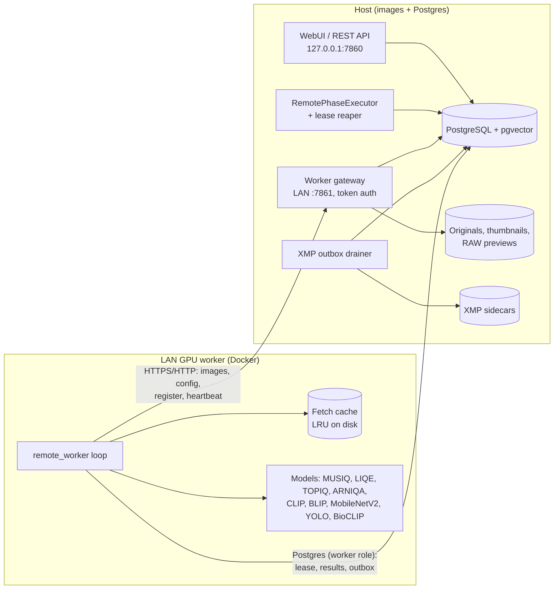

# Remote GPU worker 01: architecture

**Epic:** #435 · **Hub:** [INDEX.md](INDEX.md)

## Summary

The host stays the **control plane**. It holds:
- the originals and Postgres;
- indexing and metadata;
- run orchestration;
- all sidecar writes.

The worker is a stateless **data plane** for GPU work. For each image × phase it:
1. leases the item in Postgres;
2. fetches pixels from the host gateway by `image_id`;
3. runs the existing models;
4. commits results, phase status and an XMP outbox row in one transaction, fenced by its lease.

The host drains the outbox and writes sidecars from the current DB state.

## Today (as of master `e3eda86`)

- **Every phase reads `images.file_path` from local disk.** Models take a path: `IScoringModel.predict(image_path)` (`modules/engines/base.py:30`).
- **XMP writes are inline and synchronous inside the workers.** For example, scoring writes rating and label in `ResultWorker._handle_success_job` (`modules/pipeline.py:683`, `:701`), and tagging calls `write_metadata` (`modules/tagging.py:882`, `:1606`). The full list is in [04](04-phase-decoupling.md).
- **Runners are in-process objects.** `JobDispatcher` runs one job at a time, and `dequeue_next_job` (`modules/db_legacy.py:7225`) does a SELECT followed by a conditional UPDATE, with no `SKIP LOCKED`.
- **`image_phase_work_claims` exists** (`modules/db_postgres.py:686`). Its partial unique index `uq_ipwc_open_image_phase` blocks duplicate open image × phase work. It is keyed by `job_id` only, with no worker, lease or heartbeat.
- **Nothing tracks changes for sync:** no dirty flag, outbox or NOTIFY.
- **The API is effectively unauthenticated.**
  - `_check_api_key` (`modules/ui/security.py:76`) is never wired to a router.
  - `/api/db/query` needs no auth for reads, and writes need only the shared `X-DB-Write-Token` (`modules/api_db.py:36`).
  - Image endpoints such as `/source-image` take host paths; none serves bytes by `image_id`.
- **Postgres has one credential set and no roles or grants.** The webui binds to `127.0.0.1` unless `WEBUI_HOST` is set (`webui.py:163-166`).

## Components

| Side | Component | Status | Role |
|---|---|---|---|
| Host | PostgreSQL + pgvector | exists | Source of truth. Reachable from the worker's IP only (`pg_hba`), through a dedicated role. |
| Host | WebUI and REST API | exists | Unchanged. **Stays on `127.0.0.1`.** |
| Host | **Worker gateway** | new (M1) | A small FastAPI app on its own port (default `7861`), bound to the LAN interface. It exposes only `/worker/*` and requires a per-worker bearer token. It runs as a compose service `worker-gateway`, or as a second uvicorn server in the webui process. |
| Host | **`RemotePhaseExecutor`** | new (M4) | Registered in `phase_executors.register_all` (`modules/phase_executors.py:44`). For phases set to remote, it enqueues claims, rolls progress up into `job_phases`, propagates cancel, and completes the phase when every claim is terminal. |
| Host | **Lease reaper** | new (M4) | Requeues expired leases, and fails a claim after `remote_worker.max_attempts`. |
| Host | **XMP outbox drainer** | new (M1) | A background thread that LISTENs on `xmp_outbox`, with a polling fallback. It writes sidecars with the existing `modules/xmp.py` writers. See [03](03-xmp-outbox.md). |
| Worker | **`modules/remote_worker/`** | new (M3) | Registration, heartbeat, lease claiming, the fetch cache, compute through the phase functions split out in [04](04-phase-decoupling.md), and the fenced persist. |
| Worker | `Dockerfile.worker` + `docker-compose.worker.yml` | new (M3) | CUDA base image and `requirements/requirements_worker_gpu.txt` (the ML stack without Gradio). Model caches (`hf_cache`, `torch_cache`, `models/tfhub_cache`) live in volumes. |



## Data flow (one image × phase)

```mermaid
sequenceDiagram
  participant J as Host job (RemotePhaseExecutor)
  participant PG as Postgres
  participant W as Worker
  participant G as Gateway
  participant D as XMP drainer
  J->>PG: INSERT claims (executor='remote', status='queued')
  W->>PG: UPDATE claims SET running, worker_id, lease … FOR UPDATE SKIP LOCKED
  W->>G: GET /worker/images/{id}/rendition or /original
  G-->>W: bytes + decode route, sha256, ETag
  W->>W: compute (existing models, temp-file path)
  W->>PG: BEGIN; results; image_phase_status; INSERT outbox; UPDATE claim done (fenced); COMMIT
  PG-->>D: NOTIFY xmp_outbox
  D->>PG: read current image state
  D->>D: write sidecar (modules/xmp.py)
  D->>PG: mark outbox row processed
  J->>PG: poll claim counts → job_phases counters → phase done
```

## What stays on the host, and why

| Work | Why it stays |
|---|---|
| `indexing` | It walks the filesystem and hashes the original (`modules/image_identity_hash.py`). |
| `metadata` | It runs exiftool on the original, writes the image UUID into the file or sidecar, and fills `image_exif` and `image_xmp`. |
| Thumbnails and RAW previews | They are generated next to the originals. The gateway serves them; the worker never creates them. |
| Culling clustering into stacks | It is CPU work over stored embeddings across the whole folder. Only the per-image embedding extraction moves (INDEX D-3). |
| Every XMP and embedded-metadata write | The sidecars live next to the originals. Writes go through the outbox ([03](03-xmp-outbox.md)). |
| Run orchestration and UI | The worker only executes leased items. It never creates jobs. |

## Trust boundaries

1. **The LAN, from the worker to the host gateway.**
   - The gateway authenticates each worker with a bearer token, stored hashed in the host's `secrets.json`.
   - It accepts **`image_id` only, never paths**. The host resolves the path itself through `modules/paths.py` (`resolve_to_existing`, `:331`) and checks `system.allowed_paths`, with the same rules as `_validate_file_path` (`modules/ui/security.py:31`).
   - It is read-only except for registration and heartbeat.
2. **The LAN, from the worker to Postgres.**
   - The worker uses a dedicated role (`image_scoring_worker`): SELECT on the tables it reads, INSERT and UPDATE on the result tables, no DDL.
   - `pg_hba.conf` allows that role from the worker's IP only. `sslmode=require` is optional (M6).
3. **The main webui never listens on the LAN.** The rest of the API stays unauthenticated on `127.0.0.1`. That is why the gateway is a separate listener (INDEX D-1).
4. **The worker never uses `/api/db/query`** or the shared write token (INDEX D-6).

## Failure model

| Failure | Effect | Recovery |
|---|---|---|
| The worker crashes mid-item | The claim stays `running` until its lease expires. | The reaper requeues it with `attempts+1`. The result transaction never committed, so no partial rows exist. |
| The network drops during a fetch | The fetch fails. | The worker retries with backoff. After that it marks the claim `failed` with `last_error`, and the reaper's attempt policy applies. |
| A late worker, whose lease expired and was re-leased elsewhere | Its commit reaches the fence `UPDATE … WHERE worker_id=? AND status='running'`. | The row count is 0, so it rolls back. That rules out duplicate or stale writes. |
| The host is down or restarting | The worker cannot lease items or fetch images. | The worker backs off. Leases expire and are requeued when the host returns. |
| The drainer can't write a sidecar | The outbox row stays unprocessed and `attempts` grows. | It is retried with backoff and dead-lettered after N attempts, then surfaced in diagnostics ([03](03-xmp-outbox.md)). |
| Schema or version skew | — | The worker refuses to start if `alembic_version` doesn't match its build ([02](02-worker-protocol.md#versioning)). |

## Non-goals

- Running indexing or metadata remotely.
- Pooling work across machines over the internet. The design assumes a LAN; M6 adds TLS but not NAT traversal.
- Replacing the in-process runners. Local execution stays the default and keeps working unchanged.
- A gallery UI for workers. The gallery reads the same DB; worker status is shown in the backend's `/app`.
